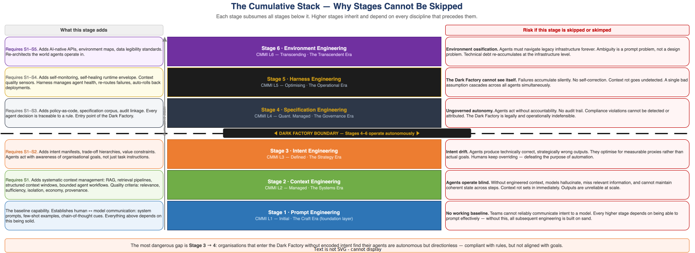

# The Cumulative Stack Explained

> **E1-04 · Foundations · Wave 1**  
> Why the six stages don't replace each other — and what breaks when organisations try to skip them.  
> See also: [Glossary of Terms](./glossary.md) · [Maturity Curve Overview](./maturity-curve.md) · [The Dark Factory](./dark-factory.md)

---

---

## What "Cumulative" Actually Means

Most technology adoption models describe replacement: one paradigm supersedes the last. Cloud replaced on-premise. Containers replaced VMs. Each new thing made the previous thing obsolete.

The AI engineering maturity curve does not work that way. Every stage in this framework **adds to** rather than **replaces** what came before. Stage 2 does not make Stage 1 unnecessary — it makes Stage 1 a prerequisite. An organisation at Stage 5 is still doing Stage 1, 2, 3, and 4. The disciplines accumulate.

This has a direct implication for organisations that want to move fast: **there are no shortcuts**. Skipping Stage 2 to get to Stage 3 does not save time — it guarantees a failure at Stage 3 that forces a return to Stage 2 anyway, but now with a partially built system to unwind.

---

## Why Each Stage Depends on the One Below

### Stage 1 is the foundation of everything

Prompt engineering is the baseline human ↔ model communication layer. Every subsequent stage depends on people and systems being able to reliably elicit useful outputs from a model. If prompt construction is poor at Stage 1, context engineering (Stage 2) cannot compensate — injecting the right information into a poorly constructed prompt still produces poor outputs.

### Stage 2 cannot work without Stage 1

Context engineering manages *what the model sees*. But how that information is framed and requested is still a Stage 1 problem. A perfectly designed RAG pipeline that injects relevant context into a badly structured system prompt will underperform. The five context quality criteria (relevance, sufficiency, isolation, economy, provenance) all assume the prompt layer is already solid.

### Stage 3 cannot work without Stage 2

Intent engineering encodes *why the agent acts*. But encoding intent into agent infrastructure only matters if the agent can reason well about the task at hand — which requires well-engineered context. An agent that operates with poor context quality will misapply intent: it will pick the wrong option from its trade-off hierarchy, or evaluate situations incorrectly against encoded values. Intent manifests built on top of bad context produce sophisticated-looking but wrong outputs.

### Stage 4 cannot work without Stage 3

Specification engineering converts rules into code and enables autonomous operation. But a specification corpus governs *what* agents do — it does not govern *why* they do it or *which goal they are serving*. Without Stage 3's encoded intent, agents at Stage 4 are rule-following automatons: they may produce outputs that are technically compliant with every specification while being entirely misaligned with organisational strategy.

> **The most dangerous gap in the framework is Stage 3 → Stage 4.** Organisations that enter the Dark Factory without solid intent engineering find their agents are autonomous but directionless — correct by the rules, wrong by the goals.

### Stage 5 cannot work without Stage 4

Harness engineering builds the self-monitoring, self-healing operational envelope. But the harness monitors for deviations from a baseline — and that baseline is defined by the Specification Corpus from Stage 4. Without a solid corpus, the harness has no reference point. It cannot detect when outputs are wrong because there is no machine-readable definition of what "right" looks like.

### Stage 6 cannot work without Stage 5

Environment engineering redesigns the world the agent operates in. But a well-designed AI-native environment only delivers its benefit to agents that are operationally reliable — agents with a harness that manages context quality, detects failures, and maintains coherent state. Without Stage 5, the clean environment is navigated by agents that drift, lose context, and cannot self-correct. The environment's legibility is wasted.

---

## What Actually Breaks When Stages Are Skipped

| Skipped stage | Common symptom | Root cause |
|---|---|---|
| Stage 1 | Models produce inconsistent, unreliable outputs despite good data | Prompt construction is too varied; there is no baseline communication standard |
| Stage 2 | Agents perform well in demos, fail in production | Context is manually curated for demos; production context is stale, incomplete, or missing |
| Stage 3 | Agents produce technically correct, strategically wrong outputs | No encoded intent; agents optimise for proxies (test pass rates, spec compliance) rather than actual goals |
| Stage 4 | Autonomous operation is fast but unauditable | No specification corpus; decisions cannot be attributed to rules; compliance is by hope not by design |
| Stage 5 | The Dark Factory works until it doesn't — and failures cascade | No self-monitoring; failures are invisible until they compound; no self-healing |
| Stage 6 | Agent capability hits a ceiling imposed by legacy infrastructure | Agents must constantly work around ambiguous APIs, undocumented data models, and organisational processes designed for humans |

---

## The Acceleration Trap

Organisations often try to skip stages because earlier stages feel like overhead. Why spend months on context engineering when the model is already producing useful outputs? Why encode intent when the team can just review outputs?

The answer is that each skipped stage creates a ceiling — a point at which the current approach breaks down and cannot be extended further without going back to build the missing foundation.

- Teams that skip Stage 2 hit a ceiling when they try to run agents over production data. Hallucination and context rot make outputs unreliable at scale.
- Teams that skip Stage 3 hit a ceiling when they try to reduce human review. Without encoded intent, every output requires human judgment to validate strategy alignment.
- Teams that skip Stage 4 hit a ceiling when they try to operate autonomously in a regulated environment. Without a specification corpus, every deployment requires human sign-off on compliance.

Building foundations takes longer upfront. Rebuilding foundations after you have already shipped a broken higher layer takes longer still.

---

## The Specification Debt Principle

The amplification argument is not just about missing stages — it is about the quality of every specification authored at each stage. Poorly-written requirements do not stay at Stage 1.

> **The Specification Debt Principle**  
> Ambiguity authored at Stage 1 does not disappear at Stage 4 — it becomes policy. Every poorly-authored requirement is a specification defect that compounds as it travels up the stack. At Stage 1 it produces a bad output. At Stage 2 it contaminates a retrieval pipeline. At Stage 3 it encodes a wrong goal. At Stage 4 it becomes law that agents enforce at production speed. The cost of fixing a specification defect multiplies at each stage transition. The cost of authoring it correctly at Stage 1 is negligible.

A worked example: an ambiguous requirement stating *"the system should handle errors gracefully"* at Stage 1 produces an inconsistent user experience. At Stage 2, the same phrase in a retrieval spec produces inconsistent document selection. At Stage 3, encoded into an intent manifest, it becomes a vague trade-off priority that agents will resolve differently each time. At Stage 4, written into a specification corpus, it becomes a policy that compliance agents enforce — confidently and at scale — against a criterion no one can define objectively. The same three words, compounding at every transition.

The cost of precision at Stage 1 is a few minutes of careful writing. The cost at Stage 4 is a specification corpus audit, a compliance review, and potentially a governance incident.

---

## The Practice Stack — Not Just a Technology Stack

The most common misreading of the cumulative stack is treating it as a technology deployment sequence. It is not. It is a practice development sequence.

Each stage represents a set of organisational disciplines that must be genuinely developed — not just technologies that must be deployed. This is why skipping stages fails. Not because the technology at higher stages won't run without lower-stage infrastructure. It will. But the *practices* at each stage build the organisational muscle required to make the next stage work. Deploy the technology without the practice, and the technology amplifies existing weaknesses rather than correcting them.

> **The Practice Premium Principle**  
> Technology components in the AI stack commoditise on the standard evolution curve — available to all, differentiating to none. The durable competitive advantage lies in the organisational practice disciplines that make those components work. These practices are emergent and tacit. They develop through deliberate learning and accumulation. They cannot be purchased. An organisation that deploys a Stage 4 specification management platform without having developed the specification discipline practices of Stages 1–3 has purchased infrastructure that will amplify its existing weaknesses. The platform does not create the practice. The practice must precede the platform.

Two organisations with identical technology stacks at Stage 4 will produce different outcomes because their practice maturity differs. One has spent three years developing specification authoring discipline, context architecture habits, and intent encoding practices. The other has licensed the same platform. The platform is identical. The outcomes are not.

---

## The Maturity Assessment Implication

Organisations should identify their *lowest solid layer*, not their highest attempted layer.

An organisation with Stage 4 tooling and Stage 2 context quality is a Stage 2 organisation with expensive technical debt. The assessment question is not *"what is the most advanced stage we have deployed?"* It is *"what is the highest stage at which every layer below it is genuinely solid?"*

This distinction matters for investment decisions. The return on Stage 4 investment depends entirely on Stage 1–3 discipline being real. Deploying a specification corpus on top of a context architecture that degrades under production load is not a Stage 4 programme. It is a Stage 2 problem with a Stage 4 label.

The framework is not a destination — it is a diagnostic. Understanding which stage you are genuinely at, and which stage you need to reach, is the starting point for every investment and roadmap decision.

---

*See also: [The Specification Discipline — Three Principles](./specification-discipline.md) · [Wardley Map](../05-strategy/wardley-map.md) · [Maturity Curve Overview](./maturity-curve.md)*  
*Back to: [Reader Guide](./reader-guide.md) · [README](../README.md)*
