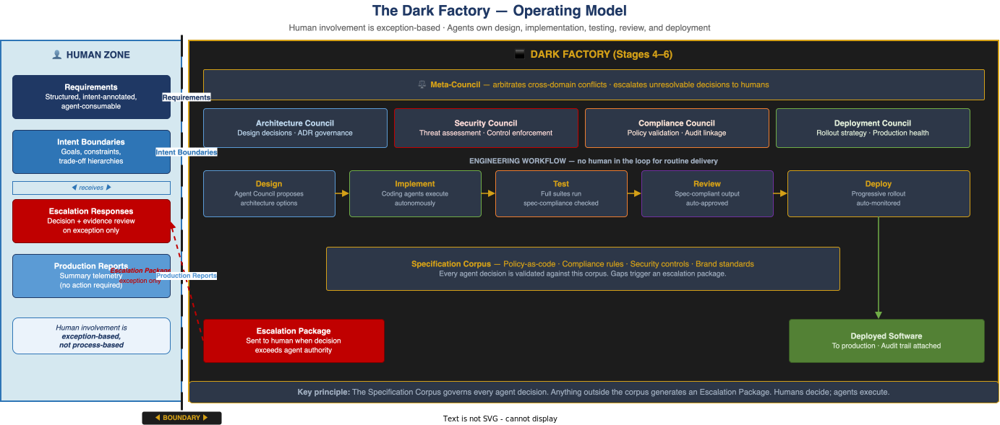

# The Dark Factory — Extended Definition

> **E1-05 · Foundations · Wave 1**  
> Full treatment of the Dark Factory concept: the manufacturing analogy, what lights-off means in software, the human role transformation, and the safeguards that make autonomous operation viable.  
> See also: [Maturity Curve Overview](./maturity-curve.md) · [Glossary of Terms](./glossary.md)

---

---

## Origins: The Manufacturing Analogy

In advanced manufacturing, a **dark factory** (or lights-out factory) is a production facility that runs entirely without human presence on the floor. Robots and automated systems handle every step — machining, assembly, quality control, logistics — while humans work elsewhere: designing processes, setting parameters, monitoring telemetry, and intervening only when automation cannot resolve an exception.

The term *dark* refers to lights being unnecessary when no humans are present.

Applied to software engineering, the Dark Factory describes the same operational mode: a workflow environment in which humans define what must be built and what constraints must be respected, and AI agents own every step of actually building it.

---

## What "Lights Off" Means in Software

In a traditional engineering team, humans are present at every stage of the workflow:

- A human writes the design document
- A human writes the code
- A human reviews the pull request
- A human approves the deployment

In the Dark Factory, agents own those steps. The workflow runs without a human in the loop for routine delivery. Humans appear at two points only:

1. **Upstream** — authoring requirements and intent boundaries before the workflow begins
2. **On exception** — receiving an escalation package when the workflow encounters a decision that exceeds agent authority

Everything between those two points is agent-operated.

---

## Entry Point: Stage 4

The Dark Factory begins at **Stage 4 — Specification Engineering**. The trigger for entry is not a technology threshold — it is a governance threshold: all corporate policies, compliance requirements, security controls, and operational rules must be encoded as machine-readable specifications that agents can consume, enforce, and audit against.

Without a Specification Corpus, agents cannot operate autonomously with accountability. The Corpus is what makes agent decisions auditable — every decision can be traced back to a specific specification. Without it, autonomous operation is ungoverned.

**Stages 1–3 are prerequisites, not shortcuts.** Organisations that attempt to jump to Stage 4 without solid context engineering (Stage 2) and intent engineering (Stage 3) will find their agents operating with insufficient information quality and no encoded organisational goals — the results are compliant but strategically wrong outputs.

---

## Structure of the Dark Factory

The Dark Factory has three structural components:

### 1. The Specification Corpus
The complete, versioned, machine-readable collection of all rules agents operate within. Every agent decision is validated against the Corpus. A decision that cannot be validated against any specification in the Corpus generates an **Escalation Package** — it does not proceed autonomously.

### 2. Agent Councils
Specialist agent collectives that govern specific domains of the workflow:

| Council | Domain |
|---|---|
| **Architecture Council** | Design decisions, ADR governance |
| **Security Council** | Threat assessment, security control enforcement |
| **Compliance Council** | Policy validation, audit linkage |
| **Deployment Council** | Rollout strategy, production health monitoring |
| **Meta-Council** | Cross-domain arbitration, escalation to humans |

Councils deliberate, propose, and govern — they do not just execute. A solo agent does not decide the system architecture; the Architecture Council deliberates and produces a recommendation validated against the Specification Corpus.

### 3. The Escalation Package
The mechanism by which the Dark Factory surfaces exceptions to humans. A well-formed Escalation Package contains everything a human needs to make a decision without re-investigating: situation summary, evidence, options considered, agent recommendation, decision record template, and the specification references that triggered the escalation.

The escalation is not a failure mode — it is the designed interface between agent autonomy and human authority.

---

## The Human Role Transformation

The Dark Factory does not eliminate humans. It radically transforms what humans do:

| Stage | Human role |
|---|---|
| Stages 1–3 (pre-Dark Factory) | Maker, reviewer, intent author |
| Stage 4 — Specification Engineering | Requirements author · Specification curator |
| Stage 5 — Harness Engineering | Exception approver · Intent boundary setter |
| Stage 6 — Environment Engineering | Environment architect · World designer |

At Stage 4, the human's primary engineering contribution is the **requirements document**. It must be structured, intent-annotated, and written to be agent-consumable. An ambiguous requirement at Stage 4 is not a prompt problem — it is an upstream defect that propagates through the entire automated workflow.

At Stage 6, the human's contribution moves further upstream still: designing the environment itself — the APIs, data contracts, capability boundaries, and infrastructure that agents will operate within for years.

---

## Risks and Safeguards

The Dark Factory introduces failure modes that do not exist in human-led workflows.

**Specification Gap** — the most common failure. An agent encounters a scenario not covered by the Specification Corpus and must either halt, guess, or escalate. The safeguard is gap analysis tooling and a well-designed escalation protocol that routes novel situations to humans with a full evidence package.

**Specification Drift** — specifications become stale as the business evolves. An agent operating against an outdated Corpus may produce outputs that are technically compliant but strategically wrong. The safeguard is version-controlled specifications with mandatory review triggers tied to business events.

**Council Capture** — an Agent Council optimises for its own domain at the expense of the whole. The Architecture Council recommends technically elegant solutions that violate commercial constraints. The safeguard is the Meta-Council, which arbitrates cross-domain conflicts and holds the authority to escalate to humans when councils cannot resolve a conflict.

**Harness Monoculture** — all agents share the same harness assumptions. A failure mode that breaks those assumptions cascades across the entire Dark Factory simultaneously. The safeguard is harness diversity, isolated failure domains, and circuit breakers between workflow stages.

**Auditability Gaps** — autonomous operation must be more auditable, not less. Every agent decision must be traceable to a specification, and every escalation must produce a decision record. The safeguard is treating audit linkage as a first-class engineering requirement, not an afterthought.

---

## What the Dark Factory Is Not

**It is not zero-human.** Humans design it, govern it, author the requirements that feed it, and approve the escalations that come out of it. The difference is that humans are no longer in the critical path of routine delivery.

**It is not a single system.** The Dark Factory is an operational mode — a way of structuring the relationship between human authority and agent autonomy. It can be implemented with many different technology choices.

**It is not the end state.** Stage 6 — Environment Engineering — represents the ongoing work of keeping the Dark Factory's world legible, navigable, and fit for purpose. The Intelligent Enterprise continuously evolves its environment rather than allowing it to ossify into a new class of legacy infrastructure.

---

*Next: [How to Use This Document — Reader Guide](./reader-guide.md)*  
*Back to: [Maturity Curve Overview](./maturity-curve.md)*
