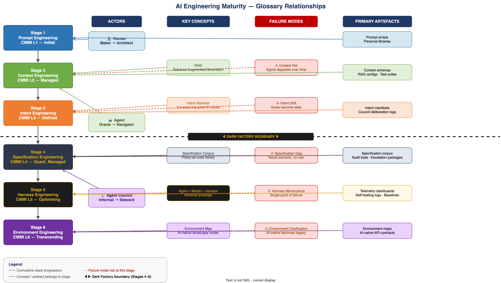

# Glossary of Terms

> **E1-01 · Foundations · Wave 1**  
> Canonical definitions for all key terms used throughout the AI Operational Maturity framework.  
> See also: [Maturity Curve Overview](./maturity-curve.md) · [Dark Factory Definition](./dark-factory.md)

---

## How to Use This Glossary

Terms are grouped thematically, not alphabetically. Start with **The Six Disciplines** if you are new to the framework. Cross-references are linked throughout.

---

## The Six Engineering Disciplines

These are the six cumulative stages of the maturity framework. Each stage **subsumes** the one below it — it does not replace it.

---

### Prompt Engineering
*Stage 1 · CMMI Level 1 — Initial*

The practice of crafting natural language instructions to elicit useful outputs from a large language model (LLM). The focus is a single interaction: one human, one model, one response.

Prompt engineering encompasses:
- **System prompts** — instructions that set the model's role, persona, and constraints
- **User messages** — the specific task or question
- **Few-shot examples** — sample inputs and outputs that guide the model's behaviour
- **Chain-of-thought cues** — instructions that encourage step-by-step reasoning

**Ceiling:** All intelligence about task, context, and intent lives in the human's head and is manually transcribed each time. Does not survive multi-step workflows, agents, or production load.

---

### Context Engineering
*Stage 2 · CMMI Level 2 — Managed*

The discipline of systematically managing what information a model sees at each step of a workflow — not just what it is asked. Where prompt engineering asks *"what do I say?"*, context engineering asks *"what does the model need to see to reason well?"*

Key practices:
- **RAG (Retrieval-Augmented Generation)** — retrieving relevant documents or data and injecting them into the context window
- **Context selection** — choosing which information is relevant, sufficient, and economical for the current task
- **Context compression** — condensing long content to fit within token limits without losing critical signal
- **State persistence** — maintaining relevant state across multiple model calls or agent steps

**Five quality criteria for context:** relevance · sufficiency · isolation · economy · provenance

**Key failure mode:** [Context Rot](#context-rot)

---

### Intent Engineering
*Stage 3 · CMMI Level 3 — Defined*

The discipline of encoding organisational goals, values, and trade-off hierarchies into agent infrastructure — not just into prompts. Where context engineering manages what the model sees, intent engineering governs what the agent is trying to achieve and why.

Key practices:
- **Intent manifests** — machine-readable documents that encode organisational goals and priorities
- **Trade-off hierarchies** — explicit rules for resolving conflicts between competing goals (e.g. speed vs. security)
- **Value constraints** — boundaries the agent must never cross regardless of task instructions
- **Intent monitoring** — detecting when agent behaviour drifts from encoded intent

**Key failure mode:** [Intent Drift](#intent-drift)

---

### Specification Engineering
*Stage 4 · CMMI Level 4 — Quantitatively Managed*

The discipline of converting all corporate policies, compliance frameworks, security controls, brand standards, and operational rules into machine-readable specifications that agents can consume, enforce, and audit against. This is the entry point of the [Dark Factory](#dark-factory).

Key practices:
- **Policy-as-code** — expressing compliance rules and governance standards in structured, executable formats
- **Specification corpus** — the complete, versioned collection of machine-readable specifications an agent operates within
- **Specification gap analysis** — identifying situations not covered by existing specifications, which require human escalation
- **Audit linkage** — ensuring every agent decision can be traced back to a specific specification

**Key failure mode:** [Specification Gap](#specification-gap)

---

### Harness Engineering
*Stage 5 · CMMI Level 5 — Optimising*

The discipline of engineering the runtime envelope — the system around the model — that makes agents reliably operable in production. The harness is everything that isn't the model itself: tool dispatch, memory management, state persistence, observability, safety enforcement, and failure recovery.

The defining formula: **Agent = Model + Harness**

Key components:
- **Tool dispatch** — routing agent actions to the correct external tools and APIs
- **Context window management** — monitoring and managing what is in the model's active context at any point
- **Observability** — sensors, dashboards, and alerts that surface agent health and behaviour
- **Self-healing** — automated detection and recovery from agent failure modes
- **Session persistence** — maintaining coherent state across context window boundaries

**Key failure mode:** [Context Rot](#context-rot) at scale; [Harness Monoculture](#harness-monoculture)

---

### Environment Engineering
*Stage 6 · CMMI Level 6 — Transcending*

The discipline of redesigning the world the agent operates in — not just the agent itself. Rather than building agents that navigate messy legacy systems, environment engineering re-architects internal APIs, codebases, data models, and organisational processes to be inherently legible, navigable, and safe for AI agents.

Key practices:
- **AI-native APIs** — interfaces designed from the ground up for agent consumption: unambiguous, formally typed, and self-documenting
- **Environment maps** — machine-readable models of the operational landscape that agents use to orient and plan
- **Data legibility standards** — how data must be structured, labelled, and versioned to be reliably consumed by agents
- **Environment health monitoring** — detecting when the real-world environment diverges from the environment model
- **Capability boundaries** — formal definitions of what agents may and may not affect in the environment

**Key failure mode:** [Environment Ossification](#environment-ossification)

---

## The Three Actor Types

### Human
A person in the engineering workflow — engineer, architect, product owner, business stakeholder, or technology leader. The human role transforms significantly across the maturity curve:

| Stage | Human Role |
|---|---|
| Stage 1 — Prompt Eng. | Sole operator — does everything |
| Stage 2 — Context Eng. | System designer and reviewer |
| Stage 3 — Intent Eng. | Intent author and governor |
| Stage 4 — Spec. Eng. | Requirements author only |
| Stage 5 — Harness Eng. | Exception approver |
| Stage 6 — Env. Eng. | Environment architect |

---

### Agent
An AI agent with persistent state, tool access, and task autonomy. Distinct from a raw LLM call in that it can take sequences of actions, use external tools, maintain state across steps, and operate within a governed runtime (the [Harness](#harness-engineering)).

Agent types relevant to engineering workflow:
- **Coding agent** — implements software against a specification
- **Review agent** — evaluates code, design, or output against standards
- **Test agent** — generates and executes test suites
- **Deployment agent** — manages progressive rollout and monitoring
- **Coordinator agent** — orchestrates other agents within a workflow
- **Compliance agent** — validates outputs against the specification corpus

---

### Agent Council
A structured collective of specialist agents that deliberate, coordinate, and govern a domain of the engineering workflow. Agent Councils are the primary governance mechanism of the [Dark Factory](#dark-factory).

Council types:
- **Architecture Council** — governs design decisions
- **Security Council** — enforces security standards and threat assessment
- **Compliance Council** — validates against regulatory and policy requirements
- **Deployment Council** — owns rollout strategy and production health
- **Meta-Council** — arbitrates conflicts between domain councils
- **Environment Council** *(Stage 6)* — stewards the AI-native environment and proposes infrastructure evolution

See: [Agent Council Design](../01-actors/council-design.md)

---

## Key Concepts & Failure Modes

### Dark Factory
The operational mode that begins at Stage 4, where humans provide requirements and intent boundaries, and agents own the full engineering workflow — design, implementation, testing, review, and deployment. Named by analogy with lights-off manufacturing automation.

**Human involvement in the Dark Factory is exception-based, not process-based.**

See: [Dark Factory — Extended Definition](./dark-factory.md)

---

### Context Rot
The degradation of an LLM's reasoning quality caused by the accumulation of stale, noisy, or irrelevant information in the context window over time. In long-running agent sessions, tool outputs, intermediate reasoning steps, and error messages build up and progressively dilute the signal the model needs to reason well.

**Symptoms:** Increasing errors in later steps of a task · agent losing track of original objectives · contradictory outputs within the same session

**Treatment:** Context compression · selective context eviction · structured state externalisation · harness-level context quality sensors

---

### Intent Drift
The condition where an agent's behaviour progressively diverges from the organisational intent it was originally encoded to serve. Caused by intent manifests that become stale as organisational strategy evolves, or by agents that find locally optimal solutions that satisfy the letter but not the spirit of encoded intent.

**Symptoms:** Agents producing technically correct outputs that feel strategically wrong · increasing rate of human override · outputs that optimise for measurable proxies rather than actual goals

---

### Specification Gap
A situation not covered by the specification corpus — where an agent encounters a scenario for which no relevant specification exists. Without a matching specification, agents either halt, guess, or produce non-compliant outputs.

**Treatment:** Gap analysis tooling · specification completeness metrics · well-designed escalation protocols that route novel situations to humans with a full evidence package

See: [Escalation Package Standard](../02-artefacts/escalation-package.md)

---

### Harness Monoculture
The condition where over-reliance on a single harness architecture creates systemic brittleness. When all agents share the same harness assumptions, a failure mode that breaks those assumptions can cascade across the entire Dark Factory simultaneously.

**Treatment:** Harness diversity · assumption stress testing · isolated failure domains · circuit breakers between workflow stages

---

### Environment Ossification
The condition where an AI-native environment, once designed and deployed, becomes a new form of legacy infrastructure — rigid, poorly documented, and resistant to change. The organisation that solved its legacy problem by building AI-native surfaces eventually faces the same problem at the infrastructure level.

**Treatment:** Environment versioning · continuous environment health review · the Environment Council's mandate to propose evolution before ossification occurs

---

### Escalation Package
A structured bundle of information sent from agents to humans when a decision exceeds agent authority or falls outside the specification corpus. A well-formed escalation package contains everything a human needs to make a decision without needing to re-investigate the situation.

Standard contents: situation summary · evidence · options considered · agent recommendation · decision record template · relevant specification references

See: [Escalation Package Standard](../02-artefacts/escalation-package.md)

---

### Requirements (in the Dark Factory context)
In Stages 4–6, the primary and often only human-authored engineering artefact. Requirements in the Dark Factory are not casual descriptions — they must be structured, intent-annotated, and written to be agent-consumable. Ambiguous requirements are an upstream defect that propagates through the entire automated workflow.

See: [Requirements Specification Templates](../02-artefacts/requirements-templates.md)

---

### Living Specification
A specification that is co-located with the work it governs, validated automatically by continuous integration, and updated iteratively as understanding evolves. Contrast with a static specification, which is written upfront, frozen after sign-off, and becomes obsolete as the system evolves. Living specifications deliver rigour without requiring completeness upfront — they mature alongside the system they describe.

The mechanism that makes a specification living is automation, not intent. A specification that someone intends to keep updated but is not validated by automated tests is a static specification with good intentions.

---

### Specification Discipline
The practice of writing specifications with semantic precision from the outset of a project, regardless of maturity stage. The Specification Discipline is founded on three principles:

1. **Rigour from the outset, not rigour all at once** — precision at Stage 1 costs almost nothing; retrofitting it at Stage 4 is enormously expensive.
2. **Living specifications, not static documents** — specifications should be emergent, iterative, and continuously refined.
3. **Universal applicability** — specification quality governs deterministic systems (rules engines, OPA) and probabilistic systems (LLM agents) equally. The failure modes differ; the discipline is the same.

See: [The Specification Discipline — Three Principles](./specification-discipline.md)

---

### Specification Corpus
The complete, versioned, machine-readable collection of all corporate policies, governance standards, compliance requirements, security controls, and operational rules that agents in Stages 4–6 operate within. The specification corpus is the primary governance mechanism of the Dark Factory — it is what makes automated decision-making auditable and accountable.

See: [Specification Corpus — Architecture & Governance](../02-artefacts/specification-corpus.md)

---

### Environment Map
A machine-readable model of the operational landscape in which agents work at Stage 6. Describes available APIs, data sources, capability boundaries, system relationships, and constraints. Agents consult the environment map to orient, plan, and validate that their actions are within bounds.

See: [Environment Map — Reference Design](../02-artefacts/environment-map.md)

---

## Acronyms & Shorthand

| Term | Meaning |
|---|---|
| LLM | Large Language Model |
| RAG | Retrieval-Augmented Generation |
| ADR | Architecture Decision Record |
| MCP | Model Context Protocol — open standard for agent-tool communication |
| A2A | Agent-to-Agent Protocol — open standard for inter-agent communication |
| PE | Prompt Engineering (Stage 1) |
| CE | Context Engineering (Stage 2) |
| IE | Intent Engineering (Stage 3) |
| SE | Specification Engineering (Stage 4) |
| HE | Harness Engineering (Stage 5) |
| EnvE | Environment Engineering (Stage 6) |
| DF | Dark Factory |

---

*Next: [Maturity Curve — Visual Overview](./maturity-curve.md)*  
*Back to: [README](../README.md)*
