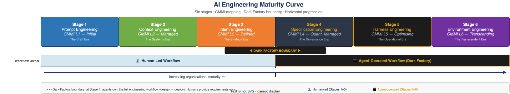
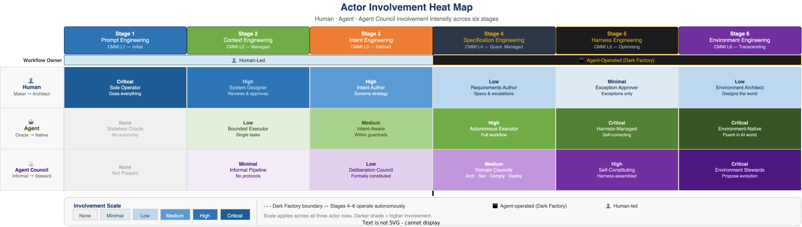

# The Maturity Curve — Visual Overview

> **E1-02 · Foundations · Wave 1**  
> A structured reference for the six-stage AI Engineering Maturity framework — stages, CMMI mapping, Dark Factory boundary, and actor involvement across the full curve.  
> See also: [Glossary of Terms](./glossary.md) · [The Dark Factory — Extended Definition](./dark-factory.md) · [The Cumulative Stack Explained](./cumulative-stack.md)

---

The AI Engineering Maturity framework describes six cumulative stages through which engineering workflow evolves as AI capability and organisational maturity increase. Each stage builds on the disciplines of every stage below it — there is no shortcut. The critical boundary lies between Stage 3 and Stage 4: the entry into the **Dark Factory**, where agents own the full engineering workflow and humans shift from directing the work to defining the conditions under which agents direct themselves. Understanding the full curve — where each stage sits, what it demands, and who owns what — is the prerequisite for making sound maturity decisions.

---

## The Maturity Curve

---

## Stage Summary

| Stage | Name | CMMI Level | Human Role | Dark Factory | Defining Characteristic |
|---|---|---|---|---|---|
| 1 | Prompt Engineering | L1 — Initial | Sole operator | No | Intelligence lives in the human's head; the model is sophisticated autocomplete |
| 2 | Context Engineering | L2 — Managed | System designer & reviewer | No | Systematically engineer what information the model sees at each workflow step |
| 3 | Intent Engineering | L3 — Defined | Intent author & governor | No | Organisational goals and trade-off priorities are encoded into agent infrastructure |
| 4 | Specification Engineering | L4 — Quantitatively Managed | Requirements author only | **Yes** | All policies converted to machine-readable specs; agents own design through deployment |
| 5 | Harness Engineering | L5 — Optimising | Exception approver only | **Yes** | The agent system self-monitors, self-corrects, and adapts within a managed runtime harness |
| 6 | Environment Engineering | L6 — Transcending | Environment architect | **Yes** | The organisation redesigns its infrastructure to be inherently AI-legible and AI-navigable |

---

## Actor Involvement

---

## The Cumulative Stack Principle

The six stages are not a replacement sequence. Each stage presupposes everything below it: an organisation operating at Stage 4 must have working Stage 1, 2, and 3 disciplines — prompt craft, context architecture, and encoded intent — or the Dark Factory cannot function. The specification corpus that Stage 4 agents enforce is only meaningful if the intent it encodes (Stage 3) is accurate and the context pipelines (Stage 2) that feed agents are reliable.

This is why attempting to shortcut to Stage 4 is one of the most common and costly failure modes. Organisations that deploy autonomous agents without first mastering context engineering and intent encoding find that agents comply with specifications but produce wrong outcomes, because the upstream disciplines that give specifications their meaning are absent. The stack is not a progression of labels — it is a load-bearing structure. Remove a layer and the layers above it collapse.

The practical implication: maturity assessment should always identify the *lowest solid layer*, not the *highest layer attempted*. An organisation that has partially implemented Stage 4 tooling while Stage 2 context quality is poor is not a Stage 4 organisation. It is a Stage 2 organisation with expensive technical debt at the top.

---

## The Dark Factory Threshold

The transition from Stage 3 to Stage 4 is the most consequential in the framework — and the most frequently underestimated. It is not simply the next step on a linear scale. It is a qualitative shift in who owns the work.

Before the threshold, humans direct the work. Agents assist, accelerate, and automate bounded tasks. Every design decision, every merge, every deployment approval has a human in the loop. The engineering workflow is a human process augmented by AI.

After the threshold, agents own the workflow. Humans define the requirements, the specifications, the intent boundaries — and then step back. Design, implementation, testing, review, and deployment are agent-operated. Human involvement is exception-based: when agents encounter a situation outside their specification envelope, they surface an escalation package to a human and wait. The human resolves the gap, the specification is updated, and the workflow resumes. This is why the transition is hard. It requires organisations to trust agent governance sufficiently to remove themselves from the loop — not as a leap of faith, but as a deliberate architectural choice backed by specification completeness, audit trails, and escalation protocols that give humans confidence without requiring their continuous presence.

---

*See also: [Glossary of Terms](./glossary.md) · [The Dark Factory — Extended Definition](./dark-factory.md) · [The Cumulative Stack Explained](./cumulative-stack.md) · [Reader Guide](./reader-guide.md)*  
*Back to: [README](../README.md)*
