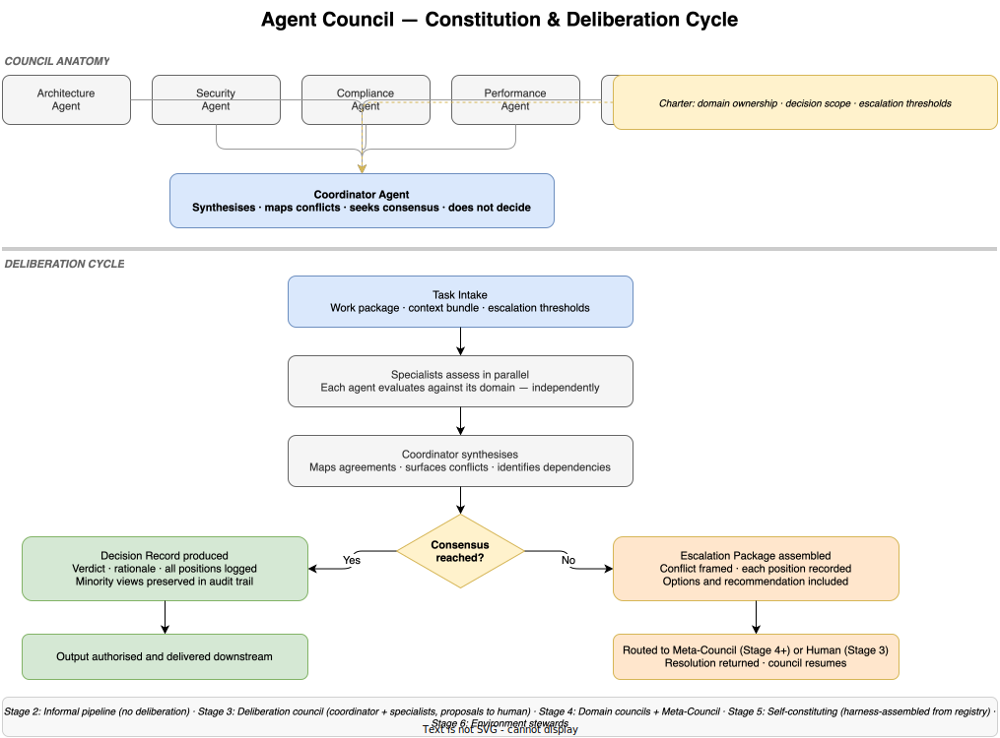

# E3-03 — Agent Council Design — Constitution & Governance

*Wave 2 · Actors*

---

## Overview

A single agent is sufficient for a bounded, well-specified task. It is not sufficient for decisions that cross domain boundaries — where architecture, security, compliance, and performance pull in different directions, and where the right answer requires weighing competing constraints that no single specialist can hold simultaneously.

Agent Councils are the mechanism for complex, cross-domain decision-making within the agentic system. A council is not a committee of equals deferring to a chair. It is a structured deliberation body with explicit roles, a defined authority scope, and a disciplined output format. Its purpose is to produce decisions that are better-grounded and more defensible than any single agent could produce — and to do so without requiring human involvement in the deliberation itself.

Councils appear in different forms across the maturity curve. At Stage 3 they are formally constituted for the first time, with a coordinator synthesising specialist views for human review. At Stage 4 they own their workflow domains and escalate only to a Meta-Council or human when they exhaust their autonomous authority. At Stage 5 the harness assembles them dynamically from a registry. At Stage 6 they become environment stewards — not decision-makers for individual tasks, but governors of the infrastructure all agents operate on.

---

## Council Anatomy

Every formally constituted Agent Council has three structural elements: specialist agents, a coordinator agent, and a council charter.

### Specialist Agents

Specialist agents are domain experts. Each specialist assesses a proposed decision exclusively from within their domain — they do not arbitrate between domains. Standard specialist roles in a software engineering council:

| Specialist Role | Domain Assessed |
|---|---|
| Architecture Agent | System design quality, coherence with existing architecture, technical debt implications |
| Security Agent | Threat surface, vulnerability exposure, compliance with security controls |
| Compliance Agent | Regulatory requirements, policy adherence, audit trail completeness |
| Performance Agent | Latency, throughput, resource consumption against defined service levels |
| Deployment Agent | Release risk, rollback feasibility, operational impact |

Council composition is not fixed. At Stage 5, the harness selects specialists from a registry based on task classification. A UI change may not require a Deployment Agent; a new data store requires a Compliance Agent even if not initially obvious. The registry maps task types to specialist configurations.

The critical property of specialist agents is **domain isolation during assessment**. A security agent that adjusts its assessment to accommodate architectural preferences has failed its function. Specialist views must be independent before the coordinator synthesises them.

### The Coordinator Agent

The coordinator is the most important role in the council — and the most easily misunderstood. The coordinator does not decide. It synthesises.

The coordinator's function:
- Collects all specialist assessments after independent evaluation
- Maps where specialists agree and where they conflict
- Identifies cross-domain dependencies that individual specialists may not have seen
- Seeks consensus by presenting the points of conflict to all specialists and allowing one round of response
- If consensus is reached: produces the decision record
- If consensus is not reached: produces the escalation package

A coordinator that overrides specialist views, suppresses minority positions, or produces a predetermined conclusion is not functioning as designed. The coordinator's output should be traceable — every decision record should show the specialist inputs that produced it.

### The Council Charter

Every council operates under a charter: a formal definition of what it owns, what it can decide, and what it must escalate. Without a charter, councils expand their authority informally, overlap with other councils, or defer decisions they are equipped to make.

A council charter defines:

| Charter Element | Description |
|---|---|
| Domain ownership | What workflow stages, artefact types, or decision categories this council owns exclusively |
| Decision authority | What the council may decide without external authorisation |
| Escalation conditions | What triggers escalation — to Meta-Council, or to human |
| Output formats | What the council produces: decision records, proposals, escalation packages, health reports |
| Deliberation time limit | Maximum time from task intake to decision or escalation — councils do not stall indefinitely |

Charter conflicts (two councils claiming ownership of the same domain) are resolved at constitution time, not mid-deliberation. The Meta-Council arbitrates charter boundary disputes.

---

## The Deliberation Protocol

Every council deliberation follows a defined sequence. The protocol is not optional — it is what makes council output trustworthy and auditable.

**1. Task intake.** The council receives the work package from the delegation handoff: scope, acceptance criteria, constraints, and escalation thresholds defined by the human or harness.

**2. Parallel specialist assessment.** Each specialist agent evaluates the task against their domain independently. Assessments are produced in parallel, not sequentially — there is no order-of-presentation bias. Each assessment records: domain findings, risks identified, recommended constraints, and any blocking concerns.

**3. Coordinator synthesis.** The coordinator collects all specialist assessments. It maps the landscape: where assessments align, where they conflict, and where dependencies exist across domains. It presents this synthesis to all specialists with a proposed resolution.

**4. Consensus check.** After synthesis, specialists confirm or dispute the proposed resolution. One round of response is permitted. Consensus means all specialists accept the resolution (not necessarily as their preferred outcome — but as within their acceptable range). If any specialist has a blocking objection, consensus is not reached.

**5a. Consensus: Decision record produced.** The coordinator produces a structured decision record containing the resolution, the rationale, and the full record of specialist positions — including any that were not adopted. Minority positions are preserved, not discarded. The decision record enters the audit trail.

**5b. No consensus: Escalation package assembled.** The coordinator produces an escalation package that frames the specific conflict, presents each specialist's position with reasoning, maps the options, and includes a recommendation. The council's work halts at the last safe checkpoint. The package routes to the Meta-Council (Stage 4+) or human (Stage 3). When the resolution is returned, the council resumes from the checkpoint with the decision injected as context.

---

## Council Charter Authority by Stage

The scope of what a council may decide autonomously expands with maturity. At Stage 3, most significant decisions go to the human for approval. At Stage 4 and beyond, the council owns its domain and escalates only the genuinely ambiguous.

| Stage | Council Authority | Escalation Destination |
|---|---|---|
| 3 — Intent Eng. | Propose architecture and implementation options; score against intent | Human (for all significant decisions) |
| 4 — Spec. Eng. | Decide within specification bounds; escalate only on spec conflict or gap | Meta-Council, then human |
| 5 — Harness Eng. | Decide and execute; harness monitors for anomalies; escalate on harness-detected drift | Meta-Council, then human via harness |
| 6 — Env. Eng. | Govern environment health; decide operational questions; propose environment changes | Human (for environment evolution proposals only) |

---

## How Councils Evolve Across the Maturity Curve

| Stage | Council Form | Composition | Deliberation Nature | Output |
|---|---|---|---|---|
| 1 — Prompt Eng. | None | — | — | — |
| 2 — Context Eng. | Informal pipeline | Multiple agents in sequence, no formal coordination | Sequential, no synthesis | Individual agent outputs, human-assembled |
| 3 — Intent Eng. | Deliberation council | Named specialists + coordinator; formally constituted | Parallel assessment + coordinator synthesis; proposals to human | Intent-aligned proposals; human decides |
| 4 — Spec. Eng. | Domain councils | Specialist councils per domain; Meta-Council for cross-domain | Full deliberation cycle; autonomous decisions within spec | Decision records; escalation packages to Meta-Council |
| 5 — Harness Eng. | Self-constituting | Harness assembles from registry per task type; councils self-evaluate | Harness-monitored deliberation; anomaly detection during cycle | Decision records + health metrics; escalation via harness |
| 6 — Env. Eng. | Environment stewards | Environment Council governs infrastructure; specialist councils handle tasks | Deliberation on environment health + task decisions | Environment evolution proposals; health reports; task decisions |

The transition from Stage 2 (informal pipeline) to Stage 3 (deliberation council) is the most significant structural change: coordination moves from being implicit (human assembles outputs) to explicit (coordinator synthesises within the council). All subsequent stages build on this foundation.

---

## Council Governance Principles

These principles apply to any council at any stage. They are not preferences — they are the conditions under which council output can be trusted.

**Single domain ownership.** No decision domain is owned by more than one council. Overlapping charters produce conflicting decisions and undermine accountability. When a cross-domain decision arises, it belongs to one council with advisory input from others — not to both councils simultaneously.

**Independent specialist assessment.** Specialist agents evaluate their domain before synthesis, not after. An architecture agent that adjusts its assessment based on the security agent's view has contaminated both assessments. Independence during assessment is a hard requirement.

**Minority position preservation.** When specialists disagree and the majority view prevails, the minority position is recorded in the decision record — not discarded. Minority positions are not errors; they are the early-warning record that proves useful when a decision is later revisited or challenged.

**Time-bounded deliberation.** Councils operate under a defined deliberation time limit from the charter. A council that has not reached a decision or produced an escalation package within the limit has failed its process. The coordinator triggers an escalation on timeout rather than allowing indefinite stall.

**Full audit trail.** Every council output — decision record or escalation package — must be fully traceable: which specialists participated, what each assessed, where they agreed and disagreed, how the coordinator resolved it. A decision that cannot be reconstructed from the audit trail is not a valid council output.

**No informal decisions.** If the decision was made outside the deliberation protocol — verbally between agents, in side-channels, or by coordinator override — it is not a council decision. Decisions made informally outside the protocol do not enter the audit trail and do not carry council authority.

---

## Council Anti-Patterns

**The rubber-stamp council.** The coordinator has a predetermined conclusion. Specialist assessments are collected but not meaningfully synthesised — they are acknowledged and then set aside. This is coordinator failure. The output looks like a council decision but lacks the cross-domain scrutiny that makes council output valuable.

**The deadlocked council.** Specialists conflict and the coordinator cannot reach consensus, but no escalation mechanism is defined or triggered. The council stalls indefinitely. Charter resolution: deliberation time limit + mandatory escalation on timeout.

**The leaky council.** Decisions within the council's charter are made informally, outside the deliberation protocol — often because the protocol is perceived as slow. Informal decisions accumulate into an undocumented backlog. When decisions are challenged, there is no audit trail.

**The expanding council.** A council gradually acquires authority over decisions outside its charter because no other council claims them. This is charter boundary failure. The Meta-Council should detect and correct charter expansion before it becomes established practice.

**The undersized specialist pool.** The council lacks a specialist for a domain that is relevant to its task class. The coordinator synthesises an incomplete picture. Decisions are made with blind spots. This is a registry failure at Stage 5, or a charter failure at Stages 3–4.

**Over-escalation.** The council escalates decisions that are within its charter authority and well-covered by the specification corpus. This inflates Meta-Council or human workload and signals that the council charter or specification is inadequately defined. Over-escalation is a training signal, not a safety property.

---

## Summary

| Element | Description |
|---|---|
| Specialist agents | Domain experts — independent assessment before synthesis |
| Coordinator agent | Synthesises, does not decide — maps agreement and conflict |
| Council charter | Domain ownership · decision scope · escalation conditions · time limit |
| Deliberation protocol | Intake → parallel assessment → synthesis → consensus check → decision or escalation |
| Decision record | Verdict · rationale · all specialist positions · minority views preserved |
| Escalation package | Conflict framed · positions recorded · options and recommendation included |
| Core governance principle | No decision outside the deliberation protocol enters the audit trail |

Agent Councils are not a coordination overhead — they are the mechanism by which complex decisions are made trustworthy at scale. A well-designed council produces decisions that are better than any single agent's judgment, fully auditable, and structurally resistant to the systematic blind spots that afflict individual specialists. The governance principles are what keep that promise intact as council autonomy increases across the maturity curve.

---

*Part of Wave 2: Actors · See also: [The Human Role Transformation](human-role.md) · [Human-Agent Handoff Protocols](handoff-protocols.md) · [Agent Taxonomy](agent-taxonomy.md) · [Agent Council Patterns](agent-council-patterns.md) · [The Meta-Council](meta-council.md)*
