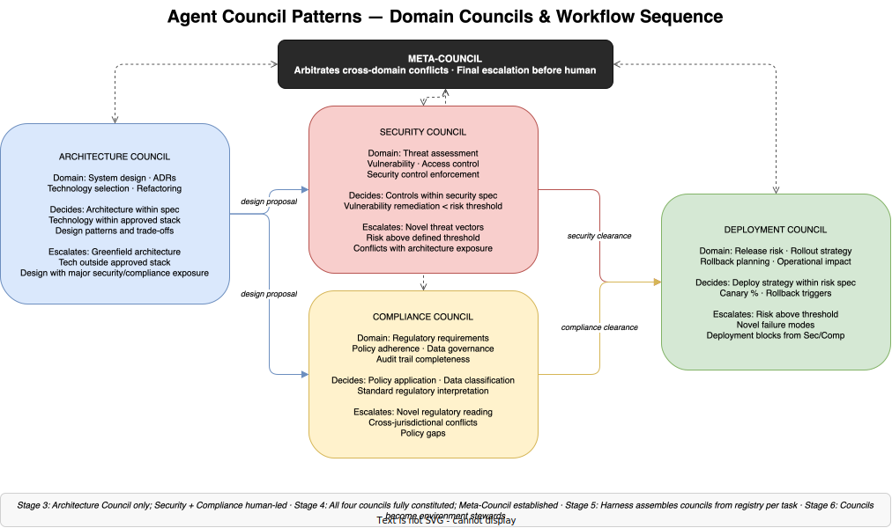

# E3-04 — Agent Council Patterns — Architecture, Security, Compliance, Deployment

*Wave 2 · Actors*

---

## Overview

The dark factory is governed by four domain councils, each owning a distinct slice of the engineering workflow. Together they cover the full lifecycle from design to production:

- **Architecture Council** — owns system design, technology selection, and ADR production
- **Security Council** — owns threat assessment, vulnerability management, and security control enforcement
- **Compliance Council** — owns regulatory requirements, policy application, and data governance
- **Deployment Council** — owns release risk, rollout strategy, and rollback planning

These councils do not overlap — each decision domain belongs to exactly one council. When a decision requires input across domain boundaries, the councils consult each other under defined patterns. When they reach an unresolvable conflict, the Meta-Council arbitrates.

The standard workflow sequence is: Architecture produces a design proposal → Security and Compliance assess in parallel → both issue clearances → Deployment plans and executes the release. Each council is a blocking gate for the next: Deployment cannot proceed without Security and Compliance clearance; Security and Compliance cannot assess without an Architecture proposal.

This document covers the specific design of each council — its domain, specialist composition, decision authority, and escalation conditions. The general deliberation protocol that applies to all four is covered in [Agent Council Design](agent-council-design.md). The Meta-Council that arbitrates between them is covered in [The Meta-Council](meta-council.md).

---

## The Architecture Council

**Domain:** System design, architecture decisions, technology selection, technical debt governance, and refactoring authority across the engineering workflow.

The Architecture Council is the upstream council — the one whose decisions create the landscape all other councils operate within. Security cannot assess a threat surface that hasn't been designed. Compliance cannot assess data governance without knowing how data flows. Deployment cannot plan a release without an architecture to deploy. The Architecture Council acts first, and its decisions shape what every other council sees.

### Specialist Composition

| Specialist Agent | Responsibility |
|---|---|
| Design Pattern Agent | Assesses proposed architecture for coherence, coupling, and known anti-patterns |
| Scalability Agent | Evaluates capacity implications, performance under load, and growth trajectory |
| Integration Agent | Assesses how the design connects to existing systems, APIs, and data contracts |
| Technical Debt Agent | Flags where the proposed design introduces or resolves existing technical debt |

### Decision Authority

The Architecture Council may decide autonomously:
- Architecture choices for new features within the existing technology stack
- Technology selection from the approved technology registry
- Refactoring approaches that do not change external contracts or system boundaries
- Architecture Decision Records (ADRs) for decisions within specification bounds
- Design pattern selection, component boundaries, and API contract shapes

### Escalation Conditions

The Architecture Council must escalate to the Meta-Council when:
- A proposed design requires technology outside the approved stack (new database engines, frameworks, or runtimes not in the registry)
- A greenfield architecture decision establishes a new system boundary or introduces a new service domain
- The proposed design creates a security exposure that the Architecture Council expects the Security Council to block — a pre-escalation before the downstream review
- Two or more internal Architecture specialists reach an unresolvable conflict on a significant design question

### Key Artefacts

- **Architecture Decision Records (ADRs)** — structured records of each significant design decision, with rationale and the options considered
- **System design documents** — component diagrams, sequence flows, API contract definitions
- **Technical debt assessments** — impact of the proposed design on existing debt
- **Technology registry updates** — proposals to add or deprecate technologies (escalated to Meta-Council for approval)

### Cross-Domain Dependencies

The Architecture Council's decisions directly constrain what Security, Compliance, and Deployment can do:
- Security: the threat surface is a direct function of the design — how services are exposed, how data moves, where credentials are held
- Compliance: data architecture (where data lives, how it is retained and deleted) is an architectural decision with regulatory consequences
- Deployment: deployability is partly an architectural property — a design that requires complex orchestration creates deployment risk

If the Architecture Council produces a proposal that Security or Compliance cannot clear, the standard response is not to block deployment — it is to return an architecture revision request so the design is changed upstream. Fixing architecture issues at the deployment gate is the failure mode to avoid.

---

## The Security Council

**Domain:** Threat assessment, vulnerability management, access control review, security control enforcement, and security sign-off on all design and implementation outputs.

The Security Council assesses the architecture proposal and the resulting implementation against the security specification corpus. Its role is to certify that what has been built does not introduce unacceptable risk, and that all required security controls have been applied. It does not design the system — but it can block a design that fails its assessment, and it must do so before Deployment clears the release.

### Specialist Composition

| Specialist Agent | Responsibility |
|---|---|
| Threat Modelling Agent | Maps the attack surface of the proposed design; identifies threat vectors |
| Vulnerability Assessment Agent | Assesses implementation for known vulnerability classes (injection, auth flaws, exposure) |
| Access Control Agent | Reviews permission models, credential handling, and least-privilege compliance |
| Security Control Agent | Verifies that all required controls from the security specification have been applied |

### Decision Authority

The Security Council may decide autonomously:
- Security assessment of architecture proposals against the security specification corpus
- Vulnerability classification and required remediation for issues within the defined risk threshold
- Security control verification — whether required controls are in place and correctly implemented
- Security sign-off on releases where no specification-covered risks are open
- Access control assessments — whether permission models comply with least-privilege requirements

### Escalation Conditions

The Security Council must escalate to the Meta-Council when:
- A threat vector is identified that falls outside the current security specification (novel attack surface, zero-day class vulnerability)
- The assessed risk of a proposed design exceeds the defined risk threshold, but the Architecture Council's design cannot be changed without significant rework
- A security control required by the specification conflicts with an architectural constraint — the control cannot be applied without redesigning the architecture
- The Security Council identifies a conflict between its assessment and the Compliance Council's requirements (a control required by Compliance creates a security exposure, or vice versa)

### Key Artefacts

- **Threat models** — structured analysis of attack surface per design proposal
- **Vulnerability reports** — catalogued vulnerabilities with classification, severity, and required remediation
- **Security sign-offs** — formal council clearance for a release to proceed to Deployment
- **Security control verification records** — evidence that each required control has been applied and tested
- **Risk exception records** — where a known risk is accepted above the threshold, with rationale and expiry date

### Cross-Domain Dependencies

- **Architecture:** The threat surface is defined by the design. If the design changes, the threat model must be re-run. The Security Council returns its assessment to the Architecture Council as a constraint on the design — not to Deployment as a block.
- **Compliance:** Security controls required by the security specification must align with controls required by regulatory frameworks. Conflicts between the two are the most common source of Security-Compliance joint escalation to the Meta-Council.
- **Deployment:** Security clearance is a required input for Deployment to proceed. If Security has open issues at release time, Deployment is blocked until they are resolved or a formal risk exception is recorded.

---

## The Compliance Council

**Domain:** Regulatory compliance, policy adherence, data governance, privacy requirements, and audit trail completeness. The Compliance Council certifies that what has been built satisfies all applicable regulatory and policy obligations.

Unlike Security, which assesses risk, Compliance assesses obligation. A security risk can sometimes be accepted with a formal exception. A compliance obligation generally cannot — the organisation is either in compliance or it is not. The Compliance Council's blocks are therefore structurally harder to escalate past than Security's.

### Specialist Composition

| Specialist Agent | Responsibility |
|---|---|
| Regulatory Agent | Applies relevant regulatory frameworks (GDPR, SOC2, HIPAA, PCI-DSS, etc.) to the design and implementation |
| Policy Enforcement Agent | Verifies that all internal policies have been applied — data retention, classification, access logging |
| Data Governance Agent | Assesses data flows, residency requirements, consent mechanisms, and deletion obligations |
| Audit Trail Agent | Verifies that the audit trail is complete — every decision traceable, every data access logged |

### Decision Authority

The Compliance Council may decide autonomously:
- Application of standard regulatory requirements to a specific design or implementation
- Data classification decisions within established classification frameworks
- Policy compliance verification — whether the implementation satisfies all in-scope internal policies
- Compliance sign-off on releases where all regulatory and policy requirements are satisfied
- Audit trail completeness assessment — whether the logging and traceability requirements are met

### Escalation Conditions

The Compliance Council must escalate to the Meta-Council when:
- A novel regulatory interpretation is required — the regulation exists but the situation is not clearly covered by prior interpretations in the specification corpus
- A design involves cross-jurisdictional data flows where different regulatory regimes conflict (GDPR data residency vs. US Patriot Act access requirements)
- A regulatory requirement conflicts with a design the Architecture Council has already cleared — the compliance fix requires architectural change
- A policy gap is identified — the situation is not covered by any existing internal policy, requiring a new policy rather than application of an existing one

### Key Artefacts

- **Compliance assessments** — structured analysis of a design or implementation against applicable regulatory frameworks
- **Data flow records** — documentation of how data moves, where it lives, and what regulatory regime applies
- **Compliance sign-offs** — formal council clearance that regulatory and policy obligations are satisfied
- **Policy gap records** — documented gaps in the policy corpus, escalated for human-authored resolution
- **Audit completeness reports** — evidence that the audit trail satisfies traceability requirements

### Cross-Domain Dependencies

- **Architecture:** Data architecture decisions — where data is stored, how it flows between services, what is retained and for how long — are both architectural and compliance decisions. The Compliance Council must assess these early, not as a final gate, to avoid late-stage architectural rework.
- **Security:** Many regulatory frameworks mandate specific security controls. The Compliance Council specifies which security controls are obligatory; the Security Council verifies they have been applied. A gap in security controls can create both a security risk and a compliance violation simultaneously.
- **Deployment:** Compliance clearance is required for Deployment to proceed. In highly regulated domains, Deployment may also require evidence that the compliance assessment has been independently reviewed — an additional constraint on the deployment process itself.

---

## The Deployment Council

**Domain:** Release risk assessment, rollout strategy, rollback planning, progressive deployment orchestration, and post-deployment monitoring thresholds.

The Deployment Council is the downstream council — the last gate before production. It receives security and compliance clearances from the two upstream councils, assesses the operational risk of the release, defines the deployment strategy, and owns the decision to proceed. If something goes wrong post-deployment, the Deployment Council owns the rollback decision.

### Specialist Composition

| Specialist Agent | Responsibility |
|---|---|
| Release Risk Agent | Assesses the operational risk of the release: blast radius, change volume, interdependencies |
| Canary Analysis Agent | Defines and monitors canary rollout parameters; assesses when to proceed or halt |
| Operational Impact Agent | Models the impact on live system performance, availability, and dependent services during and after deployment |
| Rollback Planning Agent | Designs the rollback procedure; verifies rollback is feasible and defines automated rollback triggers |

### Decision Authority

The Deployment Council may decide autonomously:
- Deployment strategy (blue-green, canary, rolling) based on risk assessment and specification
- Canary percentage and progression thresholds within the defined risk tolerance
- Deployment timing and scheduling within operational constraints
- Automated rollback trigger thresholds — what signals cause an automatic rollback
- Release proceed/hold decisions where risk is within specification bounds and all clearances are received

### Escalation Conditions

The Deployment Council must escalate to the Meta-Council when:
- The assessed release risk exceeds the defined threshold, but Security and Compliance require the release to proceed
- A novel failure mode is identified post-deployment for which no rollback procedure exists in the specification
- The Deployment Council identifies a deployment blocker that originates in a specification conflict between Security and Compliance clearance requirements
- A canary analysis shows unexpected degradation, and the Deployment Council cannot determine whether to roll back or proceed based on the defined thresholds

### Key Artefacts

- **Deployment manifests** — the approved deployment specification, including strategy, timing, and rollback conditions
- **Release risk assessments** — structured analysis of operational risk for each release
- **Rollback plans** — step-by-step rollback procedures, pre-verified for feasibility
- **Progressive deployment records** — canary metrics, progression decisions, and the rationale for proceeding at each stage
- **Post-deployment reports** — outcome record once deployment is complete: what was deployed, what was observed, whether automated rollback was triggered

### Cross-Domain Dependencies

- **Architecture:** The deployability of a release is partly an architectural property. A monolithic deployment is inherently higher-risk than a modular one. The Deployment Council can flag deployability concerns at the architecture review stage — it should not wait until deployment to raise them.
- **Security:** Security clearance is a prerequisite for deployment. Open security issues block the Deployment Council from proceeding; closed issues with risk exceptions require that the exception is formally recorded in the deployment manifest.
- **Compliance:** Compliance clearance is the second prerequisite. In regulated sectors, the deployment manifest itself is an audit artefact — it must document that all compliance requirements were satisfied before deployment proceeded.

---

## How the Councils Interact

### Standard Workflow Sequence

A feature delivery in the dark factory follows a defined council sequence:

1. **Architecture Council acts first.** It produces a design proposal and ADR. This is the input all other councils work from.

2. **Security and Compliance assess in parallel.** Both councils receive the architecture proposal simultaneously. Neither waits for the other. Each produces an independent assessment: Security a threat model and clearance decision, Compliance a regulatory assessment and clearance decision.

3. **Revision loop if needed.** If either Security or Compliance returns a block, the issue routes back to the Architecture Council for design revision. This is the primary feedback loop — security and compliance constraints resolved at the design stage, not the deployment gate.

4. **Deployment plans once both councils clear.** The Deployment Council receives both clearances and the final architecture specification. It assesses release risk, defines the deployment strategy, and executes.

5. **Post-deployment.** The Deployment Council monitors signals against the defined thresholds. Automated rollback triggers if thresholds are crossed. A post-deployment report is produced regardless of outcome.

### Cross-Council Escalation to the Meta-Council

The Meta-Council is not the default escalation path — it is the escalation path for conflicts that cannot be resolved within or between councils using the standard workflow. The most common joint escalation scenarios:

**Security vs. Compliance conflict.** A security control required by the security specification creates a data exposure that violates GDPR. Neither the Security Council nor the Compliance Council can resolve the conflict within their own authority — one must deviate from its specification. The Meta-Council arbitrates which specification takes precedence and defines the resolution.

**Architecture vs. Security block.** The Security Council has blocked a design, but the Architecture Council cannot produce a compliant alternative without significantly extending delivery timelines. The Meta-Council arbitrates whether to accept a risk exception, mandate the architectural change, or descope the feature.

**Compliance novelty requiring human involvement.** A regulatory question is genuinely novel — no prior interpretation exists and the Compliance Council cannot rule with confidence. The Meta-Council escalates to the human with a fully packaged decision request, including the council's preferred interpretation and the risk of each option.

**Deployment risk above threshold with business pressure.** The Deployment Council has assessed the release as exceeding the risk threshold, but the business case for proceeding is compelling. The Meta-Council arbitrates whether to extend the risk threshold for this release, mandate changes to reduce risk, or hold.

### Council Consultation Patterns

Beyond the standard workflow, councils consult each other informally during deliberation. These consultations are not escalations — they are advisory inputs that one council requests from another before finalising its own assessment:

- **Architecture requests a pre-assessment from Security** before finalising a design choice — checking whether a proposed data architecture will pass Security review before it is committed to an ADR
- **Compliance requests a data flow map from Architecture** before finalising its regulatory assessment — confirming exactly where data lives and how it moves
- **Deployment requests confirmation from Security** that a detected post-deployment anomaly is not a security indicator requiring emergency rollback

These consultations are time-bounded. A council requesting input from another must specify a response window; if the window expires, the requesting council proceeds on the information it has and notes the gap in its assessment.

---

## Council Patterns Across the Maturity Curve

The four councils as described above are fully constituted at Stage 4. They emerge earlier in partial form and evolve structurally at Stages 5 and 6.

| Stage | Council State |
|---|---|
| 2 — Context Eng. | No formal councils. Security and Compliance are human-led with agent assistance. Architecture decisions made by human engineers. |
| 3 — Intent Eng. | Architecture Council may be informally constituted — a coordinator synthesises agent inputs for human review. Security and Compliance remain primarily human-governed. |
| 4 — Spec. Eng. | All four councils fully constituted. Domain ownership is explicit and enforced. Meta-Council established. Standard workflow sequence in place. |
| 5 — Harness Eng. | Harness assembles councils from a registry based on task classification. A pure UI change may not require a full Compliance Council; a data schema change always does. Council composition is dynamic, not fixed. |
| 6 — Env. Eng. | Councils evolve into environment stewards. The Architecture Council becomes the Environment Architecture Council, proposing infrastructure evolution. Security and Compliance councils assess environment contract changes. Deployment Council monitors environment publication surfaces. |

---

## Summary

| Council | Domain | Specialist Roles | Decides | Escalates To Meta-Council |
|---|---|---|---|---|
| **Architecture** | System design, ADRs, tech selection | Design Pattern · Scalability · Integration · Technical Debt | Architecture within spec; approved technology; refactoring | Greenfield changes; tech outside stack; major cross-domain exposure |
| **Security** | Threat assessment, vulnerability, controls | Threat Modelling · Vulnerability · Access Control · Control Verification | Security assessment; vulnerability remediation < threshold; sign-off | Novel threats; risk above threshold; Sec/Comp conflict |
| **Compliance** | Regulatory, policy, data governance | Regulatory · Policy Enforcement · Data Governance · Audit Trail | Policy application; data classification; sign-off | Novel regulatory reading; cross-jurisdictional conflict; policy gaps |
| **Deployment** | Release risk, rollout strategy, rollback | Release Risk · Canary Analysis · Operational Impact · Rollback Planning | Deploy strategy; canary %; rollback triggers; release proceed/hold | Risk above threshold; novel failure modes; clearance conflicts |

The four councils are not independent — they are deliberately coupled through the workflow sequence and cross-domain consultation patterns. The quality of the dark factory's output depends on how well these coupling points are designed: how cleanly the Architecture Council's proposals feed the assessment councils, how rapidly Security and Compliance issues route back to design rather than accumulate at the deployment gate, and how decisively the Meta-Council resolves the conflicts that none of the four can absorb on their own.

---

*Part of Wave 2: Actors · See also: [Agent Council Design](agent-council-design.md) · [The Meta-Council](meta-council.md) · [Human-Agent Handoff Protocols](handoff-protocols.md)*
