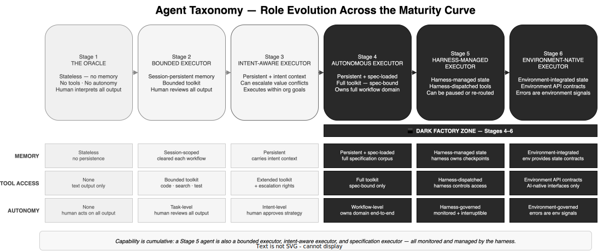

# E3-02 — Agent Taxonomy — Types, Capabilities, Limitations

*Wave 2 · Actors*

---

## Overview

The word "agent" is used across all six stages of this framework, but it describes fundamentally different entities at each one. A Stage 1 oracle is a stateless language model invoked on demand. A Stage 6 environment-native executor works fluently within AI-native infrastructure it was designed to inhabit. They share almost nothing except the label.

The taxonomy below maps how agents change in kind — not just degree — as maturity increases. Each form is defined by three properties: what the agent remembers across interactions, what tools it can access, and how much it is permitted to decide on its own. Together these three dimensions define the agent's capability envelope — the space within which it can act without human intervention.

Capability is cumulative. A Stage 4 autonomous executor has not replaced the Stage 2 bounded executor — it has subsumed it. Every agent at Stage 4 and above can also do bounded task execution, intent-aware escalation, and everything below. What changes at each stage is the upper bound of autonomous authority, not the lower.

---

## Stage 1 — The Stateless Oracle

**What it is:** A language model invoked on demand with no persistent state, no tools, and no defined role in a workflow.

At Stage 1, there is no "agent" in the autonomous sense. The LLM is a sophisticated text-generation system that produces outputs for a human to evaluate, edit, and act on. It has no memory of prior interactions. Each prompt is a fresh invocation. The human holds all task context in their head and transcribes the relevant portion into each prompt.

**Memory:** Stateless. Each invocation is independent. Anything the model needs to know must be in the current prompt.

**Tool access:** None. The model produces text. The human runs code, executes searches, and takes all downstream actions.

**Autonomy:** None. The model proposes; the human decides whether to use the output and how.

**Limitation at this form:** Every capability of the agent is bounded by what the human can fit into a single prompt. Knowledge is non-transferable — when the human closes the session, everything is gone.

---

## Stage 2 — The Bounded Executor

**What it is:** A persistent agent that executes defined tasks within a human-designed workflow, with scoped tool access and human review of all outputs.

At Stage 2, agents acquire two properties that transform their usefulness: persistent memory within a session, and access to tools. A coding agent can read a codebase, write code, run tests, and return results — without the human doing any of those steps manually. The human designs the workflow and reviews the outputs; the agent executes within it.

**Memory:** Session-scoped. The agent carries context through a single workflow run. Between runs, state is cleared or explicitly managed by the human-designed context pipeline (RAG, retrieval, injected context schemas).

**Tool access:** Bounded toolkit defined by the workflow designer — typically code execution, codebase retrieval, documentation search, and test runners.

**Autonomy:** Task-level. The agent makes implementation decisions within the task boundary (how to write a function, which test cases to generate). All outputs are reviewed by a human before use.

**What the agent cannot do at this form:** Initiate tasks, escalate conflicts, make strategic decisions, or persist state beyond the session. It operates entirely within the boundary a human set before it started.

---

## Stage 3 — The Intent-Aware Executor

**What it is:** An agent that executes within organisational intent constraints and can flag or decline actions that conflict with encoded values.

At Stage 3, agents are given something beyond context and tools: awareness of organisational intent. Business goals, trade-off hierarchies, and strategic priorities are encoded into the agent's operating context — not just as instructions but as constraints that the agent evaluates its own decisions against. An intent-aware agent can recognise that a technically correct implementation conflicts with a strategic priority and escalate rather than proceed.

**Memory:** Persistent — the agent maintains state across workflow steps and carries intent context throughout the session. The intent manifest is part of its base context.

**Tool access:** Extended — the same as Stage 2 toolkit, plus escalation rights: the agent can formally flag a decision and route it to a human or deliberation body when it detects an intent conflict.

**Autonomy:** Intent-level. The agent makes decisions that fall within the intent manifests without human involvement. When a proposed action conflicts with encoded intent, the agent escalates rather than proceeding or suppressing the conflict.

**What the agent cannot do at this form:** Act outside the intent manifests, make decisions that require business judgement beyond the encoded intent, or proceed through an unresolvable intent conflict. Escalation is mandatory, not optional, when the agent identifies a genuine conflict.

---

## ◾ Dark Factory Entry — Stage 3 → Stage 4

> At the Stage 3/4 boundary, agents stop being participants in human-governed workflows and become the operators of their own workflow domains. Design, implementation, testing, review, and deployment move from human-reviewed to agent-executed.

---

## Stage 4 — The Autonomous Specification Executor

**What it is:** An agent that implements, tests, and deploys within a specification corpus, without human involvement per workflow step. Escalation is triggered only by specification conflict or gap.

At Stage 4, the agent's operating context includes the full specification corpus — all machine-readable corporate policies, compliance frameworks, security controls, and operational standards. The agent's job is to execute within those specifications completely. If the specifications provide a clear answer, the agent acts. If two specifications conflict or a situation falls outside all specifications, the agent escalates.

**Memory:** Persistent and specification-loaded. The agent has access to the full specification corpus as part of its base context. Prior decisions, implementation logs, and audit trails are maintained continuously.

**Tool access:** Full toolkit within specification bounds. The agent may use any tool its specification corpus authorises — including deployment tooling, production access, and automated testing infrastructure. Specification compliance is enforced at every tool invocation.

**Autonomy:** Workflow-level. The agent owns its domain from design through deployment. It makes no implementation, review, or deployment decision that requires human approval — unless a specification conflict or gap triggers escalation. Human involvement is exception-based.

**What the agent cannot do at this form:** Operate outside the specification corpus. If a situation is not covered by any specification, the agent escalates — it does not improvise. If two specifications conflict, the agent cannot resolve the conflict by choosing one — it escalates to the Meta-Council or human for arbitration.

---

## Stage 5 — The Harness-Managed Executor

**What it is:** An agent operating within a self-monitoring harness that manages its state, tool dispatch, and lifecycle — and can pause, re-route, or replace it mid-task.

At Stage 5, the agent is not simply executing within constraints — it is executing within a live operational envelope that monitors it continuously. The harness manages context quality, detects drift, and acts on anomalies without waiting for the agent to flag them. An agent that shows degraded context quality, anomalous behaviour, or drift from baseline patterns can be paused, re-started, or replaced by the harness in real time.

**Memory:** Harness-managed. The harness owns the checkpoint and state persistence layer. If an agent is paused or replaced, its state is preserved by the harness and transferred to the replacement agent. The agent does not manage its own continuity.

**Tool access:** Harness-dispatched. The harness mediates all tool invocations — not just defining what tools are available, but controlling timing, sequencing, and retry behaviour. Tool failures are handled by the harness, not the agent.

**Autonomy:** Harness-governed. The agent operates autonomously within the harness envelope, but the harness defines that envelope and can modify it in real time based on telemetry. The agent is interruptible at any point by a harness signal, not just by a human-initiated escalation.

**What the agent cannot do at this form:** Operate outside the harness envelope, persist state independently, manage its own tooling, or determine its own escalation thresholds. Those properties belong to the harness layer. The agent is an executor within a monitored container.

---

## Stage 6 — The Environment-Native Executor

**What it is:** An agent that works fluently within an AI-native infrastructure designed to be inherently legible, navigable, and safe for autonomous operation.

At Stage 6, the agent's operating environment has been re-architected from the ground up to be AI-native. APIs are formal and unambiguous. Data models are structured for agent consumption. Codebase contracts are explicit. The agent does not reverse-engineer legacy systems, work around human-oriented interfaces, or infer implicit conventions. Ambiguity in the environment is an infrastructure defect — surfaced as an environment signal — not a prompt problem.

**Memory:** Environment-integrated. State management is a property of the environment — provided as a first-class service with clear contracts. The agent does not manage persistence; the environment does.

**Tool access:** Environment API contracts. The agent works exclusively through AI-native interface surfaces. There are no legacy APIs, no human-oriented UIs adapted for agent use, no informal interfaces. Every action the agent can take is defined by a formal, versioned environment contract.

**Autonomy:** Environment-governed. The agent's autonomy is bounded by environment contracts, not ad hoc specifications or harness rules. Correctness is structural — the environment enforces it. Errors are surfaced as environment signals (the contract was violated, the state is inconsistent) rather than as agent failures to follow instructions.

**What the agent cannot do at this form:** Act outside the environment contracts, modify the environment itself (that is the Environment Council's role, subject to human approval), or improvise around interface ambiguity. The environment's rigidity is the feature, not the limitation.

---

## Capabilities Across the Maturity Curve

| Dimension | Stage 1 | Stage 2 | Stage 3 | Stage 4 | Stage 5 | Stage 6 |
|---|---|---|---|---|---|---|
| **Memory** | Stateless | Session-scoped | Persistent + intent | Persistent + spec-loaded | Harness-managed | Environment-integrated |
| **Tool access** | None | Bounded toolkit | Extended + escalation rights | Full toolkit (spec-bound) | Harness-dispatched | Environment API contracts |
| **Autonomy level** | None | Task-level | Intent-level | Workflow-level | Harness-governed | Environment-governed |
| **Escalation authority** | N/A | None — human monitors | Intent conflicts → human | Spec conflicts → Meta-Council → human | Harness detects → routes automatically | Environment signals → Environment Council |
| **Who defines the envelope** | Human (prompt) | Human (workflow design) | Human (intent manifests) | Specification corpus | Harness configuration | Environment contracts |

---

## Limitations That Persist Across All Stages

Some limitations apply to agents at every stage, regardless of maturity level. These are not deficiencies to be engineered away — they are structural properties of the model:

**Agents cannot define their own authority scope.** An agent's authority at any stage is defined externally — by intent manifests, specification corpus, harness configuration, or environment contracts. An agent that expands its own authority has violated the model, not evolved within it.

**Agents cannot update the specification corpus or intent manifests without authorisation.** An agent that discovers a specification gap can escalate it; it cannot resolve it by adding its own specification. Corpus maintenance is a human-governed activity at all stages.

**Agents cannot suppress the audit trail.** Every decision an agent makes within its autonomous authority must be logged. There is no legitimate reason for an agent to act without trace.

**Agents cannot create agents without authorisation.** An agent may propose the creation of new agent types (this is a council function at Stage 6), but may not self-replicate or spawn agents outside the defined assembly mechanism.

**Agents remain accountable to the humans who defined their operating context.** Increased autonomy is not decreased accountability. The agent's decisions are auditable and attributable to the intent, specification, or environment that authorised them.

---

## Summary

| Stage | Form Name | Core Capability | Envelope Defined By |
|---|---|---|---|
| 1 | Stateless Oracle | Produces text for human evaluation | Human prompt |
| 2 | Bounded Executor | Executes tasks within human-designed workflows | Human workflow design |
| 3 | Intent-Aware Executor | Executes within org intent; escalates conflicts | Intent manifests |
| 4 | Autonomous Spec. Executor | Owns full workflow domain within spec bounds | Specification corpus |
| 5 | Harness-Managed Executor | Operates within live monitored envelope | Harness configuration |
| 6 | Environment-Native Executor | Works within AI-native infrastructure contracts | Environment contracts |

The evolution from oracle to environment-native executor is the evolution of the agent's authority envelope: from a prompt the human typed, to a world the organisation built. At each stage, what has been engineered — intent, specification, harness, environment — is what enables the agent to act without asking. Quality of that engineering determines quality of everything the dark factory produces.

---

*Part of Wave 2: Actors · See also: [The Human Role Transformation](human-role.md) · [Human-Agent Handoff Protocols](handoff-protocols.md) · [Agent Council Design](agent-council-design.md)*
