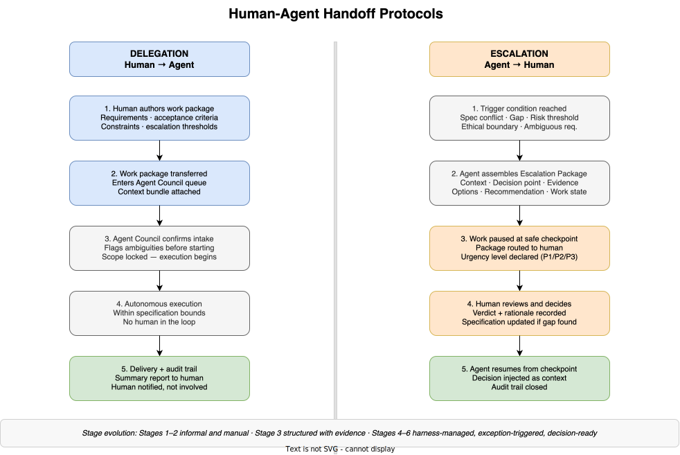

# E3-06 — Human-Agent Handoff Protocols

*Wave 2 · Actors*

---

## Overview

A handoff is the moment of transfer: work moving from human to agent, or from agent back to human. These transfers are the load-bearing joints of the dark factory. When they work, the exception-based model functions as designed — humans are involved rarely, decisively, and productively. When they fail, work stalls, agents proceed without authority, or humans are pulled into operational detail they were supposed to be out of.

Two directions:

- **Delegation** — human to agent. The human authors a work package and hands it into the agentic system. The agent Council receives, confirms intake, executes autonomously, and delivers.
- **Escalation** — agent to human. The agent reaches the limit of its autonomous authority, assembles an evidence package, pauses, and routes the decision to the human. The human decides, records the verdict, and the agent resumes.

Both directions have a required protocol. Neither is optional. A delegation without clear escalation thresholds is an open invitation for agents to handle decisions they shouldn't. An escalation without a packaged decision request dumps raw operational complexity on a human who is not positioned to absorb it.

---

## The Delegation Handoff — Human to Agent

The delegation handoff transfers a unit of work from human authority into agent execution. Five steps:

**1. Human authors the work package.** The core human contribution. Includes:
- Scope — what is in and what is out
- Acceptance criteria — how the agent knows the work is complete
- Constraints — what the agent may and may not do (risk tolerance, technology choices, compliance boundaries)
- Escalation thresholds — explicit conditions under which the agent should halt and escalate rather than decide autonomously

**2. Work package enters the agent queue.** The package is transferred to the Agent Council with a context bundle — relevant prior work, applicable specifications, standards references, and any prior decisions that bear on this task.

**3. Agent Council confirms intake.** Before execution begins, the Council acknowledges receipt, flags any ambiguities in the requirements, and declares the scope locked. This is not optional — it is the last opportunity to surface misalignment before autonomous execution starts. Unresolved ambiguities at this point become escalations mid-task.

**4. Autonomous execution.** The Council executes within the bounds of the specification corpus and the delegation package. No human is involved. Escalation conditions defined in step 1 are monitored continuously.

**5. Delivery and audit trail.** The Council delivers the output and a summary report. The human is notified of completion with a summary; they do not review individual implementation decisions unless they specifically request it.

### What a Good Delegation Package Contains

| Element | Description |
|---|---|
| Scope | What the agent is responsible for — and what is explicitly excluded |
| Acceptance criteria | Measurable conditions that define completion |
| Constraints | Technology, risk, compliance, and operational boundaries |
| Context bundle | Relevant prior work, applicable specifications, known decisions |
| Escalation thresholds | Explicit conditions that require human input rather than autonomous resolution |

---

## The Escalation Handoff — Agent to Human

Escalation is not a failure — it is the designed mechanism for handling decisions that exceed the agent's autonomous authority. Five steps:

**1. Trigger condition reached.** The agent detects a situation it is not authorised to resolve independently. This is a defined class of events, not an arbitrary agent choice.

**2. Agent assembles the Escalation Package.** Before routing to the human, the agent constructs a decision-ready package. Dumping raw state on the human is not an escalation — it is a failure of the protocol.

**3. Work paused at the last safe checkpoint.** The agent records the work state and halts at a point from which execution can be safely resumed. The package is routed to the human with a declared urgency level.

**4. Human reviews and decides.** The human reads the package, selects or constructs a response, and records the verdict with rationale. If the escalation revealed a specification gap, the human updates the specification corpus before authorising resumption — so this situation does not recur.

**5. Agent resumes from checkpoint.** The decision is injected into the agent's context. Execution continues from the recorded checkpoint. The audit trail is closed with the verdict and any specification changes.

### The Escalation Package

Every escalation to a human must include all of the following:

| Element | Description |
|---|---|
| Context summary | What the agent was doing when the trigger was reached |
| Decision point | The specific question requiring human judgment — one sentence |
| Evidence | Data, logs, and specification references that led to the escalation |
| Options considered | What the agent evaluated and why each was insufficient for autonomous resolution |
| Agent recommendation | The agent's preferred resolution, with rationale |
| Work state | Where execution is paused — the checkpoint from which resumption will occur |
| Impact of non-resolution | What happens to the work if the human does not respond |
| Urgency level | P1 (blocking, time-critical) · P2 (important, not immediate) · P3 (advisory) |

An escalation package that omits any of these elements is incomplete. Incomplete packages slow human decision-making and undermine the model.

### Trigger Conditions

| Trigger | Description | First Appears |
|---|---|---|
| Ambiguous requirement | Requirement is insufficient for autonomous execution | Stage 2 |
| Risk threshold | Action would exceed the agent's authorised risk envelope | Stage 3 |
| Intent conflict | Two or more encoded intent signals contradict each other | Stage 3 |
| Specification conflict | Two or more specifications contradict — agent cannot reconcile | Stage 4 |
| Specification gap | Situation falls outside all existing specification coverage | Stage 4 |
| Harness anomaly | Harness detects agent behaviour outside defined baselines | Stage 5 |
| Environment drift | Real-world state diverges from the environment model | Stage 6 |

---

## How Handoffs Evolve Across Stages

The mechanics of both directions shift significantly as maturity increases. At early stages, handoffs are informal and human-initiated. At later stages, they are structured, harness-managed, and almost entirely protocol-driven.

| Stage | Delegation Nature | Escalation Nature |
|---|---|---|
| 1 — Prompt Eng. | None — human does all work directly | None — no agents to escalate |
| 2 — Context Eng. | Task-level: bounded coding or testing jobs | Ad hoc: human monitors outputs and intervenes manually |
| 3 — Intent Eng. | Initiative-level: features or domains; agent manages decomposition | Structured: agent flags intent conflicts with evidence; human resolves |
| 4 — Spec. Eng. | Workflow-level: requirements in, delivery out | Exception-based: full escalation packages; rare and decision-ready |
| 5 — Harness Eng. | Harness-managed: requirements trigger autonomous cycles; harness orchestrates | Pre-assembled by harness: human sets exception threshold, not individual escalation criteria |
| 6 — Env. Eng. | Environment-level: outcomes and constraints only | Environment proposals: councils propose infrastructure changes for human approval |

The direction of travel is consistent: delegation packages grow more abstract and less operational; escalation packages grow more structured and decision-ready. At Stage 5 and 6, a human receiving an escalation should be able to decide without asking a single clarifying question — the package answers every question before it is asked.

---

## Handoff Anti-Patterns

### Delegation Failures

**Ambiguous scope.** "Do the authentication feature" without acceptance criteria or explicit constraints. The agent proceeds, makes implicit decisions the human did not authorise, and delivers something that surprises.

**Missing escalation thresholds.** The delegation package specifies what to do but not what to halt on. Agents proceed through decisions they should have escalated. The human discovers this at delivery, not mid-execution.

**Context gaps.** The agent lacks relevant specifications and starts anyway, making assumptions about standards and constraints rather than surfacing the gap at intake.

### Escalation Failures

**Raw dump.** The agent returns log files, error messages, or a stack trace and expects the human to diagnose. This is not an escalation — it is a transfer of the agent's diagnostic problem to the human.

**Over-escalation.** The agent escalates decisions it was authorised and equipped to make. This inflates human workload and defeats the purpose of autonomous execution.

**Under-escalation.** The agent handles decisions outside its authority — resolving specification conflicts, accepting novel risk, or making strategic choices without human input. These are the decisions most likely to cause downstream damage.

**Decision without trace.** The human makes a verbal or informal decision. No record is created, no specification is updated. The same escalation recurs because the gap that caused it was never closed.

---

## Summary

| Protocol Element | Delegation | Escalation |
|---|---|---|
| Direction | Human → Agent | Agent → Human |
| Trigger | Human initiates a unit of work | Agent reaches the limit of autonomous authority |
| Core package | Scope · Criteria · Constraints · Context · Escalation thresholds | Decision point · Evidence · Options · Recommendation · Work state |
| Human action | Author and transfer | Review, decide, record verdict, update specification |
| Agent action | Confirm intake, execute autonomously, deliver | Detect trigger, assemble package, pause, resume |
| Primary failure mode | Ambiguous scope or missing escalation thresholds | Raw dump, or decision made without trace |

Handoffs are where the dark factory's efficiency is either realised or lost. A well-authored delegation package makes autonomous execution possible. A well-assembled escalation package makes human decisions fast, traceable, and system-improving. Both disciplines must be engineered — they do not emerge from good intentions.

---

*Part of Wave 2: Actors · See also: [The Human Role Transformation](human-role.md) · [Agent Taxonomy](agent-taxonomy.md) · [Agent Council Design](agent-council-design.md)*
