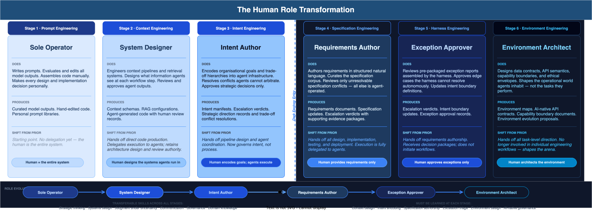

# E3-01 — The Human Role Transformation

*Wave 2 · Actors*

---

## Overview

Across the six stages of AI engineering maturity, the human role does not disappear — it transforms. The arc moves from **direct maker** to **environment architect**: from doing the work, to designing the systems that do the work, to encoding the goals those systems pursue, to providing the requirements they act on, to approving only the exceptions they cannot resolve, to designing the world they inhabit.

Each stage shift is a deliberate act of delegation — not abdication. What transfers across every stage is judgment, domain knowledge, strategic thinking, and accountability. What must be learned at each stage is a new abstraction: from writing prompts, to engineering context, to encoding intent, to authoring specifications, to triage of exceptions, to design of environments.

---

## Stage 1 — Sole Operator

**Role:** The human is the entire system.

At Stage 1, AI assistance is a tool wielded by an individual. The engineer writes prompts, evaluates outputs, edits results, and assembles everything manually. The model has no memory, no tools, no autonomy. Every decision — design, implementation, review, deployment — sits with the human.

**What they do:**
- Write and iterate prompts to elicit useful model outputs
- Manually evaluate, edit, and curate model-generated content
- Assemble code, documents, and decisions from raw model outputs
- Hold all task context in their head; nothing is externalised

**What they produce:**
- Curated model outputs
- Hand-edited code
- Personal prompt libraries (notebooks, text files)

**Key demand at this stage:** Prompt craft — the ability to elicit useful outputs through natural language.

**Risk:** All knowledge and capability is person-dependent. Non-transferable, non-auditable, non-repeatable.

---

## Stage 2 — System Designer

**Role:** The human designs the systems agents operate within.

At Stage 2, agents begin to appear as persistent workers in bounded workflows. The human's job shifts from doing the work to architecting the information environment that makes agent work possible. They design retrieval systems, context schemas, and workflow pipelines. They still review and approve all agent outputs.

**What they do:**
- Engineer context pipelines, RAG systems, and retrieval architectures
- Define what information agents receive at each workflow step
- Set quality standards for agent outputs
- Review and approve agent-generated code, tests, and documentation

**What they produce:**
- Context schemas — what gets injected at each workflow step
- RAG and retrieval pipeline configurations
- Agent-generated artefacts with human review records

**Shift from Stage 1:** Hands off direct code production. Delegates execution to agents; retains architecture and review authority.

**Key demand at this stage:** Systems design — the ability to engineer information environments that agents can navigate reliably.

**Risk:** Context rot. Retrieval systems that work in development but degrade in production without active monitoring.

---

## Stage 3 — Intent Author

**Role:** The human encodes organisational goals and governs by intent.

At Stage 3, the human moves from designing systems to encoding strategy. Organisational values, trade-off hierarchies, and business intent are converted into agent infrastructure — not just prompts or pipeline configs. Agents can now act with awareness of business context. The human approves strategic decisions; agents handle the rest.

**What they do:**
- Encode organisational goals, priorities, and trade-off hierarchies into intent manifests
- Resolve conflicts agents cannot arbitrate (competing intent signals, novel risk)
- Approve major strategic design decisions
- Review escalations where agents have flagged intent conflicts

**What they produce:**
- Intent manifests — machine-readable encodings of organisational goals
- Escalation verdicts — rulings on agent-flagged intent conflicts
- Strategic direction records

**Shift from Stage 2:** Hands off pipeline design and agent coordination. Now governs intent, not process.

**Key demand at this stage:** Intent encoding — the ability to translate organisational strategy into machine-actionable goal structures.

**Risk:** Intent drift. Encoded goals become stale as strategy evolves; agents optimise for outdated intent without detection.

---

## ◾ Dark Factory Entry — Stage 3 → Stage 4

> At the Stage 3/4 boundary, the human exits the engineering workflow entirely. Design, implementation, testing, review, and deployment become agent-operated. The human role shifts from a participant in the workflow to a provider of inputs to the workflow.

---

## Stage 4 — Requirements Author

**Role:** The human provides requirements. Everything else is agent-operated.

At Stage 4, the human's contribution to the engineering workflow narrows to one domain: authoring requirements and curating the specification corpus. All design, implementation, testing, and deployment is handled by Agent Councils operating within that specification. Human involvement is exception-based — triggered only when agents encounter a specification conflict they cannot resolve.

**What they do:**
- Author requirements in structured natural language with clear acceptance criteria
- Curate and maintain the specification corpus (policies, standards, compliance rules)
- Review escalations that arrive as fully packaged evidence bundles
- Approve or overturn agent-generated decisions only when the specification is insufficient

**What they produce:**
- Requirements documents — structured, agent-consumable
- Specification updates — adding coverage for novel situations
- Escalation verdicts — decisions accompanied by full evidence packages

**Shift from Stage 3:** Hands off all design, implementation, testing, and deployment decisions. Execution is fully delegated.

**Key demand at this stage:** Requirements authorship — the ability to write requirements precise enough for agent-operated execution with no human in the loop.

**Risk:** Specification completeness gaps. Agents comply with specs, but specs don't cover novel situations. Brittle governance at the edges.

---

## Stage 5 — Exception Approver

**Role:** The human approves only what the harness cannot resolve.

At Stage 5, a self-monitoring harness manages the entire dark factory — orchestrating agents, detecting drift, recovering from failure, and assembling exception reports when human input is genuinely required. The human does not initiate workflows or make routine decisions. They receive pre-packaged decision requests and respond. Their primary contribution shifts to updating the intent boundaries that determine what the harness handles autonomously.

**What they do:**
- Review exception reports assembled by the harness — pre-packaged with full context, evidence, and options
- Approve the minority of edge cases where human judgment is structurally required
- Update intent boundary definitions to expand the harness's autonomous decision envelope

**What they produce:**
- Escalation verdicts
- Intent boundary updates — expanding what the harness may decide autonomously
- Exception approval records

**Shift from Stage 4:** Hands off requirements authorship to a standing specification. Receives decision packages; does not initiate workflows.

**Key demand at this stage:** Escalation triage — the ability to make high-quality decisions quickly from pre-packaged evidence, under low-frequency but high-stakes conditions.

**Risk:** Harness monoculture. Over-reliance on harness assumptions that break at novel system boundaries. The human may not receive signals about failure modes outside the harness's detection envelope.

---

## Stage 6 — Environment Architect

**Role:** The human designs the world agents operate in.

At Stage 6, the organisation has stopped adapting agents to work around legacy infrastructure and instead re-architects the environment to be inherently navigable by AI. The human role is now one of environment design: defining data contracts, API semantics, capability boundaries, and ethical envelopes. They do not direct individual engineering tasks. They shape the arena in which all engineering happens.

**What they do:**
- Design AI-native data contracts, API semantics, and knowledge base structures
- Define capability boundaries — what agents may and may not affect
- Establish ethical envelopes — the constraints that apply across all agent behaviour
- Review and approve environment evolution proposals from the Environment Agent Council

**What they produce:**
- Environment maps — machine-readable models of the operational landscape
- AI-native API contracts — formal, unambiguous, versioned
- Capability boundary documents
- Environment evolution approvals

**Shift from Stage 5:** Hands off all task-level direction. No longer involved in individual engineering workflows — shapes the arena.

**Key demand at this stage:** Environment design — the ability to architect systems that are inherently legible, navigable, and safe for autonomous AI agents at scale.

**Risk:** Environment ossification. AI-native environments become new legacy over time; the organisation must continuously evolve the environment itself or create a new class of technical debt at the infrastructure level.

---

## Skills That Transfer Across All Stages

Not all skills become obsolete as the human role transforms. Several capabilities become *more* valuable as autonomy increases:

| Transferable Skill | Why It Increases in Value |
|---|---|
| Strategic thinking | The higher the delegation, the more consequential each human decision |
| Systems design thinking | Understanding how components interact is required at every abstraction level |
| Judgment under uncertainty | Escalations are structurally the hard cases — low frequency, high stakes |
| Domain knowledge | Agents cannot substitute for deep expertise in requirements authorship or specification curation |
| Communication | Intent manifests and requirements documents must be precise enough for autonomous execution |
| Governance | The human becomes the governance layer; this role expands, not contracts |

---

## Skills Required at Each New Stage

| Stage | New Skill Required |
|---|---|
| Stage 2 | Context engineering — designing information environments for agents |
| Stage 3 | Intent encoding — translating strategy into machine-actionable goal structures |
| Stage 4 | Specification authorship — writing requirements precise enough for fully autonomous execution |
| Stage 5 | Escalation triage — high-quality decision-making from pre-packaged evidence |
| Stage 6 | Environment design — architecting AI-native infrastructure at organisational scale |

---

## Summary

| Stage | Role Name | Primary Contribution | Human Touch |
|---|---|---|---|
| 1 — Prompt Eng. | Sole Operator | Everything — design, code, review, deploy | Every task, every output |
| 2 — Context Eng. | System Designer | Architecture of agent-supporting systems | Review and approval |
| 3 — Intent Eng. | Intent Author | Organisational goals, trade-off resolution | Strategic decisions only |
| 4 — Spec. Eng. | Requirements Author | Requirements and specification corpus | Exception-triggered only |
| 5 — Harness Eng. | Exception Approver | Intent boundaries, escalation verdicts | Exception-triggered only |
| 6 — Env. Eng. | Environment Architect | World design — data contracts, API semantics, ethical envelopes | Environment evolution decisions |

The direction of travel is consistent: from operational involvement to strategic architecture. The human becomes the author of constraints rather than the executor of tasks — and the quality of those constraints determines the quality of everything the dark factory produces.

---

*Part of Wave 2: Actors · See also: [Agent Taxonomy](agent-taxonomy.md) · [Agent Council Design](agent-council-design.md) · [Human-Agent Handoff Protocols](handoff-protocols.md)*
