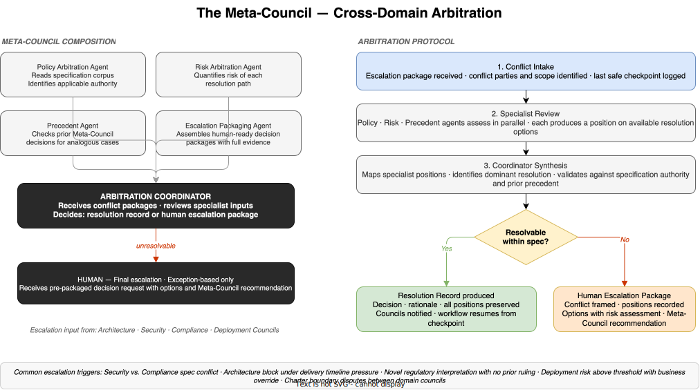

# E3-05 — The Meta-Council — Cross-Domain Arbitration

*Wave 2 · Actors*

---

## Overview

The four domain councils — Architecture, Security, Compliance, and Deployment — each own a distinct slice of the engineering workflow. Most decisions stay within a single council's authority. Some do not. When a decision requires crossing domain boundaries, and the councils involved cannot resolve it under standard consultation patterns, it routes to the Meta-Council.

The Meta-Council is the dark factory's arbitration layer. It sits above the domain councils and below the human. Its purpose is to resolve cross-domain conflicts that no individual council can absorb on its own, without requiring human involvement in every dispute. When the Meta-Council cannot resolve a conflict within the specification corpus, it escalates to the human — but it does so with a fully packaged decision request, not a raw conflict.

The Meta-Council is not a standing governance body that meets on a schedule. It is convened on demand, when a conflict is escalated to it. Between escalations, it does not operate.

---

## Composition

Every Meta-Council deliberation is structured around an Arbitration Coordinator and four specialist arbitrators.

### Arbitration Coordinator

The Arbitration Coordinator is the Meta-Council's central role. It receives the escalation package from the escalating council, manages the specialist review process, synthesises the arbitration inputs, and produces the output — either a Resolution Record or a Human Escalation Package.

The Arbitration Coordinator follows the same principle as the domain council coordinator: it synthesises, it does not decide. Its output is traceable to the specialist inputs that produced it. An Arbitration Coordinator that overrides the specialist positions or produces a predetermined resolution has failed its function.

### Specialist Arbitrators

| Specialist | Responsibility |
|---|---|
| **Policy Arbitration Agent** | Reads the specification corpus to identify which specifications apply to the conflict and which carries higher authority. Resolves conflicts between specifications by reference to the hierarchy of policy authority. |
| **Risk Arbitration Agent** | Quantifies the risk of each available resolution path. Produces a risk-ordered ranking of options so the Coordinator and, if needed, the human can compare them on a common basis. |
| **Precedent Agent** | Searches prior Meta-Council decision records for analogous cases. Where precedent exists, the Precedent Agent surfaces it as the primary resolution path, unless the new case is materially different. |
| **Escalation Packaging Agent** | Activated only when the Arbitration Coordinator determines that the conflict cannot be resolved within the specification corpus. Assembles the human-ready escalation package: conflict framed, all council positions recorded, resolution options with risk assessments, and the Meta-Council's preferred recommendation. |

---

## When the Meta-Council Is Convened

The Meta-Council is the escalation path for conflicts that cannot be resolved within or between councils using standard consultation patterns. Domain councils do not escalate casually — over-escalation is an anti-pattern that inflates Meta-Council workload and signals that charters or specifications need sharpening.

The most common triggers:

**Security vs. Compliance specification conflict.** A security control required by the security specification creates a data exposure that violates a regulatory requirement enforced by the Compliance Council. Neither council can deviate from its specification without a higher authority ruling on which specification takes precedence. This is the most frequent Meta-Council trigger in regulated industries.

**Architecture block under delivery timeline pressure.** The Security or Compliance Council has blocked a design. The Architecture Council cannot produce a specification-compliant alternative without significantly extending delivery timelines. The business case for accepting a risk exception or descoping the feature requires an authority above the domain councils.

**Novel regulatory interpretation required.** A regulatory question is genuinely novel — the regulation exists but the situation is not clearly covered by any prior interpretation in the specification corpus. The Compliance Council cannot rule with confidence. The Meta-Council determines whether an interpretation can be constructed from existing authority or whether the question must go to the human.

**Deployment risk above threshold with business override pressure.** The Deployment Council has assessed the release as exceeding the defined risk threshold. The business case for proceeding is compelling. The Meta-Council arbitrates whether to extend the risk threshold for this release, mandate changes to reduce risk, or hold — and documents the rationale for whichever it decides.

**Charter boundary disputes.** Two domain councils each claim authority over a decision that spans their domains. The Meta-Council resolves the ownership question and, if needed, updates the charter boundary so the same conflict cannot recur.

---

## The Arbitration Protocol

When a domain council escalates to the Meta-Council, the following protocol applies. It mirrors the domain council deliberation cycle, adapted for cross-domain conflict rather than domain-internal decision-making.

**1. Conflict Intake.** The Meta-Council receives the escalation package from the escalating council. The package must include: the specific conflict or question, the positions of each council involved (with reasoning), the last safe checkpoint from which the halted workflow can resume, and the consequences of each resolution option. Incomplete packages are returned to the escalating council for completion before arbitration begins.

**2. Specialist Review.** The Policy, Risk, and Precedent agents assess the conflict in parallel. Each produces an independent position on the available resolution options. The Policy Arbitration Agent identifies which specification authority applies. The Risk Arbitration Agent quantifies the risk profile of each resolution option. The Precedent Agent surfaces analogous prior decisions where they exist.

**3. Coordinator Synthesis.** The Arbitration Coordinator collects the specialist positions, maps where they align, identifies the dominant resolution, and checks it against specification authority and prior precedent. If the specialist positions converge on a clear resolution path, the Coordinator drafts the Resolution Record.

**4. Resolution decision.** If the conflict is resolvable within the specification corpus — meaning the specification hierarchy, risk assessments, and precedent together point to a clear answer — the Meta-Council produces a Resolution Record. If the conflict requires a judgment that exceeds the specification corpus — a genuinely novel situation, an irresolvable tie between competing specifications of equal authority, or a decision that requires business-level trade-off authority — the Escalation Packaging Agent assembles the Human Escalation Package and the conflict routes to the human.

---

## Resolution Record

When the Meta-Council resolves a conflict autonomously, it produces a Resolution Record containing:

- The resolution itself — what is decided
- The specification authority underpinning the decision — which spec or policy hierarchy justified it
- The full positions of all specialist arbitrators, including any that were not adopted
- The precedent case applied, if any
- The rationale for departing from precedent, if the case was judged materially different
- The resolution injected into the halted workflow — the councils that escalated the conflict are notified and resume from the last safe checkpoint with the decision as new context

Resolution Records enter the audit trail and are available to the Precedent Agent for future arbitrations.

---

## Human Escalation Package

When the Meta-Council determines that the conflict exceeds its autonomous authority, the Escalation Packaging Agent assembles a decision-ready package for the human. The human receives:

- **Conflict statement** — a clear, specific description of what is in dispute and why it cannot be resolved within the specification corpus
- **Council positions** — the full position of each domain council involved, with reasoning
- **Options** — the available resolution paths, each with its specification basis, risk assessment, and projected outcome
- **Meta-Council recommendation** — the Meta-Council's preferred resolution and the reasoning behind it
- **Consequences of no decision** — what happens to the halted workflow if no decision is returned within the defined window

The human returns a decision. The Meta-Council records it, injects it into the halted workflow, and logs it as a precedent for future arbitrations. If the decision reflects a gap in the specification corpus, the human's ruling is also a signal that the specification needs updating — this is flagged in the record.

---

## What the Meta-Council Does Not Do

The Meta-Council governs conflicts, not operations. Several things it explicitly does not do:

**It does not manage the workflow.** Domain councils own their workflow stages. The Meta-Council only acts when a cross-domain conflict is escalated to it. It does not monitor or intervene in domain councils that are operating within their charters.

**It does not replace domain council decisions.** A domain council decision that is within its charter authority and within specification bounds is not subject to Meta-Council review. The Meta-Council is the escalation path for what domain councils cannot decide, not a review board for what they have decided.

**It does not create specifications.** When the Meta-Council encounters a specification gap, it can apply judgment to resolve the immediate conflict — but it does not author new policy. New specifications are human decisions. The Meta-Council flags the gap and routes the policy question to the human.

**It does not absorb all cross-domain questions.** Domain councils consult each other informally all the time — Architecture requesting a pre-assessment from Security, Compliance requesting a data flow map from Architecture. These consultations are not Meta-Council matters. The Meta-Council is reserved for conflicts where the standard consultation patterns have been tried and failed.

---

## The Meta-Council Across the Maturity Curve

The Meta-Council is first formally constituted at Stage 4, when the domain councils themselves are established. Before Stage 4, cross-domain conflicts are resolved by human engineers and architects directly.

| Stage | Meta-Council State |
|---|---|
| 1–3 | Not present. Cross-domain conflicts are resolved by human engineers and architects. |
| 4 — Spec. Eng. | Formally constituted. Arbitrates cross-domain conflicts between the four domain councils. Escalates to human when conflict exceeds specification corpus. |
| 5 — Harness Eng. | Harness-monitored. The harness can detect Meta-Council deliberation anomalies (timeout, repeated escalation of the same conflict pattern) and flag them as system health signals. Precedent corpus grows as the Meta-Council accumulates decision history. |
| 6 — Env. Eng. | Meta-Council authority extends to environment-level conflicts — disputes between councils over environment contract changes, infrastructure evolution proposals, and environment boundary definitions. Specification corpus is replaced in part by environment contracts as the primary authority source. |

---

## Governance Properties

**Single arbitration authority.** There is no body above the Meta-Council except the human. If councils disagree with a Meta-Council resolution, the only recourse is to request a human review. The Meta-Council cannot be bypassed.

**Precedent-bound decisions.** The Meta-Council is constrained by its own prior decisions. When a prior Resolution Record exists for an analogous case, the Meta-Council applies it unless the Precedent Agent identifies a material difference. Precedent-bound decisions are faster to produce and more predictable in outcome.

**Time-bounded arbitration.** The Meta-Council operates under a defined deliberation time limit. If the conflict cannot be resolved or packaged for human escalation within the limit, the Arbitration Coordinator triggers an automatic human escalation. Indefinite stall is not permitted.

**Audit trail completeness.** Every Meta-Council output — Resolution Record or Human Escalation Package — is fully auditable. The record shows which councils escalated, the positions of all specialists, how the resolution was reached, and which specification authority underpinned it. No Meta-Council decision may enter the workflow without a complete audit record.

---

## Summary

| Element | Description |
|---|---|
| **Purpose** | Arbitrate cross-domain conflicts that no domain council can resolve autonomously |
| **Composition** | Arbitration Coordinator + Policy, Risk, Precedent, and Escalation Packaging specialists |
| **Convened** | On demand, when a domain council escalates a conflict |
| **Outputs** | Resolution Record (autonomous) or Human Escalation Package (unresolvable) |
| **Escalation ceiling** | Human — receives pre-packaged decision request with options and recommendation |
| **Active from** | Stage 4 — Specification Engineering |
| **Key constraint** | Does not create specifications; does not replace domain council decisions within charter |

The Meta-Council is what makes the dark factory governable at scale. Without it, cross-domain conflicts either stall in domain council deadlock, accumulate as informal workarounds outside the audit trail, or flood the human with decisions that the councils should be able to resolve. With it, the system has a defined authority path for the conflicts that matter most — the ones where no single domain's rules are sufficient — and the human receives only what the system genuinely cannot resolve on its own.

---

*Part of Wave 2: Actors · See also: [Agent Council Design](agent-council-design.md) · [Agent Council Patterns](agent-council-patterns.md) · [Human-Agent Handoff Protocols](handoff-protocols.md)*
