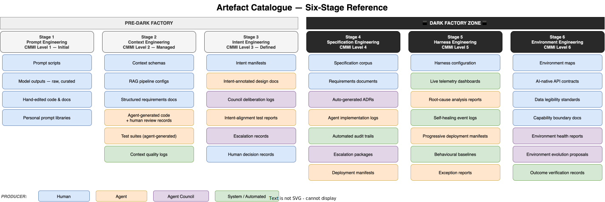

# Artefact Catalogue — All Stages

*E4-01 · Wave 3 — Artefacts · Audience: All*

---

## Overview

Every stage of the AI Operational Maturity Framework produces a distinct set of artefacts. These are not just outputs — they are the durable records, configurations, and governance documents that make the workflow repeatable, auditable, and transferable. As the framework matures, two things change: the **producer shifts** (from human to agent to council) and the **purpose shifts** (from personal capture toward systemic governance).

This catalogue records what is produced at each stage, who produces it, and what role it plays in the workflow.

---

## How to Read This Catalogue

**Producer colour coding** (matches the diagram):
- **Blue — Human:** authored, curated, or approved by a human engineer, architect, or strategist
- **Orange — Agent:** generated autonomously by one or more AI agents
- **Purple — Agent Council:** produced through council deliberation or coordination
- **Green — System / Automated:** emitted by the infrastructure itself (harness, pipelines, monitoring systems)

**Persistence:** Artefacts introduced at an earlier stage continue to exist at later stages, usually in more structured or automated form. The catalogue shows where each artefact is *first introduced*, not where it disappears.

---

## Stage 1 — Prompt Engineering

*All artefacts are human-produced. No structured governance.*

| Artefact | Producer | Description |
|---|---|---|
| Prompt scripts | Human | Natural language instructions crafted per-task. Informal, personal, undocumented. |
| Model outputs — raw, curated | Human | The model's response as manually selected and edited by the engineer. No provenance. |
| Hand-edited code & docs | Human | Implementation produced by combining model output with manual work. Inseparable authorship. |
| Personal prompt libraries | Human | Collections of useful prompts in notebooks, text files, or personal wikis. Not shared or governed. |

**Artefact characteristic:** entirely person-dependent, non-transferable, no repeatability or auditability. Knowledge dies with the practitioner.

---

## Stage 2 — Context Engineering

*Human-designed infrastructure artefacts appear. Agents begin producing implementation records.*

| Artefact | Producer | Description |
|---|---|---|
| Context schemas | Human | Formal specifications of what information is injected at each workflow step. The design blueprint for RAG pipelines. |
| RAG pipeline configs | Human | Configuration of retrieval architectures: data sources, chunking strategies, embedding models, retrieval parameters. |
| Structured requirements docs | Human | Requirements stored in machine-readable systems (Jira, Confluence, structured YAML) that agents can retrieve and act on. |
| Agent-generated code + review records | Agent | Code produced by coding agents with injected context. Paired with human review notes that constitute the approval trail. |
| Test suites | Agent | Unit and integration tests generated by agents. Require human review of coverage and edge case adequacy. |
| Context quality logs | System | Automated records of retrieval hit rates, relevance scores, and context window utilisation. The earliest form of system self-observation. |

**Artefact characteristic:** human-designed, agent-assisted. The human engineers the information environment; the agent works within it.

---

## Stage 3 — Intent Engineering

*Organisational intent is externalised into machine-readable form. Council governance produces its first records.*

| Artefact | Producer | Description |
|---|---|---|
| Intent manifests | Human | Machine-readable documents encoding organisational goals, strategic priorities, and trade-off hierarchies. The primary instrument of intent governance. |
| Intent-annotated design docs | Agent | Architecture and design documents produced by agents, with explicit annotations linking each decision to the intent manifest that authorised it. |
| Council deliberation logs | Agent Council | Structured records of how the Agent Council evaluated options, which specialists contributed which positions, and what the coordinator synthesised. |
| Intent-alignment test reports | Agent | Automated test results that assess not just functional correctness but whether the output serves the stated organisational intent. |
| Escalation records | Agent Council | Records of decisions the council could not resolve within intent boundaries, with the full context package prepared for human review. |
| Human decision records | Human | Documented outcomes of human escalation reviews: what the human decided, why, and whether intent was updated as a result. |

**Artefact characteristic:** intent externalised. For the first time, agent decisions are traceable to a formal organisational mandate rather than an individual's judgement call.

---

## Stage 4 — Specification Engineering

*Entry into the Dark Factory. Human artefacts are the requirements boundary. All implementation artefacts are agent-produced.*

| Artefact | Producer | Description |
|---|---|---|
| Specification corpus | Human | The complete set of machine-readable policies, compliance rules, security controls, brand standards, and operational constraints. The law of the Dark Factory. |
| Requirements documents | Human | Structured natural language specifications from business stakeholders and architects. The primary and often only direct human contribution to the engineering workflow. |
| Auto-generated ADRs | Agent Council | Architecture Decision Records produced autonomously by the Architecture Council, validated against the specification corpus, and logged for audit. |
| Agent implementation logs | Agent | Line-by-line records of agent implementation activity, each action annotated with the specification rule that authorised it. |
| Automated audit trails | System | Comprehensive decision records linking every output to the specification and requirements it satisfies. The compliance substrate of the Dark Factory. |
| Escalation packages | Agent Council | Pre-packaged evidence bundles sent to humans when a specification conflict cannot be resolved autonomously. Structured for rapid human decision-making. |
| Deployment manifests | Agent | Auto-generated deployment configurations, validated against specification-defined risk envelopes before execution. |

**Artefact characteristic:** specification-governed. Human artefacts define the law; agent artefacts demonstrate compliance with it.

---

## Stage 5 — Harness Engineering

*The operational envelope is itself engineered. The system monitors and records its own behaviour.*

| Artefact | Producer | Description |
|---|---|---|
| Harness configuration | Human | The runtime envelope specification: tool dispatch rules, agent state management policies, safety enforcement boundaries, and failure recovery protocols. |
| Live telemetry dashboards | System | Real-time views of agent health, context quality, drift signals, and task progress. The system's continuous self-portrait. |
| Root-cause analysis reports | Agent | Automated post-mortems on task failures and anomalies, produced by the harness's diagnostic agents and surfaced for review. |
| Self-healing event logs | System | Records of every harness intervention: what failure was detected, what corrective action was taken, and the outcome. |
| Progressive deployment manifests | Agent | Deployment plans that include live signal thresholds and auto-rollback rules. The manifest governs both deployment and the conditions for its reversal. |
| Behavioural baselines | System | Continuously updated models of what normal agent and system behaviour looks like, used to identify anomalies and trigger diagnostic cycles. |
| Exception reports | Agent | Pre-packaged human-ready summaries of situations requiring human input, with the decision context, options, and harness recommendation included. |

**Artefact characteristic:** self-observing. The system does not just produce outputs — it produces a continuous record of its own operational health.

---

## Stage 6 — Environment Engineering

*The environment itself is an artefact. Human artefacts define the shape of the world agents operate in.*

| Artefact | Producer | Description |
|---|---|---|
| Environment maps | Human | Machine-readable models of the operational landscape: what systems exist, what they expose, what agents may interact with, and how they interconnect. |
| AI-native API contracts | Human | Formal, unambiguous, versioned interface specifications designed for agent consumption. Clarity is a design requirement, not an afterthought. |
| Data legibility standards | Human | Standards specifying how data must be structured, labelled, and versioned to be reliably usable by agents. Ambiguity in data is treated as an environment defect. |
| Capability boundary docs | Human | Documents defining the envelope of what agents may and may not affect — their operational jurisdiction and ethical perimeter. |
| Environment health reports | Agent Council | Council-produced assessments of whether the environment surfaces agents work on remain accurate, accessible, and aligned with current operational reality. |
| Environment evolution proposals | Agent Council | Structured proposals from the Environment Council for infrastructure changes, submitted to human environment architects for approval. |
| Outcome verification records | System | Records confirming that the environment produced the intended result — not just that an agent's output was correct, but that it had the intended effect in the world. |

**Artefact characteristic:** environment-as-artefact. The humans design the world; the agents navigate it; the councils maintain it.

---

## Cross-Stage Reference

| Artefact | First Stage | Producer | Category |
|---|---|---|---|
| Prompt scripts | S1 | Human | Requirements & Intent |
| Model outputs — raw, curated | S1 | Human | Implementation |
| Hand-edited code & docs | S1 | Human | Implementation |
| Personal prompt libraries | S1 | Human | Configuration |
| Context schemas | S2 | Human | Configuration |
| RAG pipeline configs | S2 | Human | Configuration |
| Structured requirements docs | S2 | Human | Requirements & Intent |
| Agent-generated code + review records | S2 | Agent | Implementation |
| Test suites | S2 | Agent | Tests & Quality |
| Context quality logs | S2 | System | Operational Records |
| Intent manifests | S3 | Human | Requirements & Intent |
| Intent-annotated design docs | S3 | Agent | Implementation |
| Council deliberation logs | S3 | Agent Council | Governance & Audit |
| Intent-alignment test reports | S3 | Agent | Tests & Quality |
| Escalation records | S3 | Agent Council | Governance & Audit |
| Human decision records | S3 | Human | Governance & Audit |
| Specification corpus | S4 | Human | Requirements & Intent |
| Requirements documents | S4 | Human | Requirements & Intent |
| Auto-generated ADRs | S4 | Agent Council | Governance & Audit |
| Agent implementation logs | S4 | Agent | Governance & Audit |
| Automated audit trails | S4 | System | Governance & Audit |
| Escalation packages | S4 | Agent Council | Governance & Audit |
| Deployment manifests | S4 | Agent | Operational Records |
| Harness configuration | S5 | Human | Configuration |
| Live telemetry dashboards | S5 | System | Operational Records |
| Root-cause analysis reports | S5 | Agent | Governance & Audit |
| Self-healing event logs | S5 | System | Operational Records |
| Progressive deployment manifests | S5 | Agent | Operational Records |
| Behavioural baselines | S5 | System | Tests & Quality |
| Exception reports | S5 | Agent | Governance & Audit |
| Environment maps | S6 | Human | Configuration |
| AI-native API contracts | S6 | Human | Configuration |
| Data legibility standards | S6 | Human | Configuration |
| Capability boundary docs | S6 | Human | Requirements & Intent |
| Environment health reports | S6 | Agent Council | Governance & Audit |
| Environment evolution proposals | S6 | Agent Council | Governance & Audit |
| Outcome verification records | S6 | System | Tests & Quality |

---

## Artefact Families

Six persistent artefact families run across the full maturity curve. Each evolves in producer, structure, and purpose as the organisation matures.

### 1. Requirements & Intent

The progressive externalisation of what humans want.

> Prompt scripts → Structured requirements docs → Intent manifests → Specification corpus → Capability boundary docs

At S1, intent is locked in a human's head and transcribed ad hoc. By S6, it is a formal, versioned contract between the human environment architect and the agent system.

### 2. Configuration & Schema

The engineering of the information environment agents operate within.

> Personal prompt libraries → Context schemas + RAG configs → Harness configuration → AI-native API contracts + Data legibility standards

At S1, configuration is a personal notebook. By S6, it is a formally specified, AI-native operational surface.

### 3. Implementation Records

The trace of what was built and by whom.

> Hand-edited code & docs → Agent-generated code + review records → Intent-annotated design docs → Agent implementation logs

At S1, authorship is inseparable from the human hand. By S4, every implementation action is logged against the specification that authorised it.

### 4. Tests & Quality

The verification that outputs are correct and aligned.

> (none at S1) → Test suites → Intent-alignment test reports → Automated audit trails → Behavioural baselines → Outcome verification records

Testing begins as human-reviewed agent output and evolves into continuous structural verification at environment level.

### 5. Governance & Audit

The record of decisions, deliberations, and escalations.

> (none at S1-S2) → Council deliberation logs + Escalation records + Human decision records → Auto-generated ADRs + Escalation packages → Root-cause analysis reports + Exception reports → Environment evolution proposals

Governance artefacts appear at S3 when Agent Councils form. By S6, they govern the evolution of the operational environment itself.

### 6. Operational Records

The system's continuous account of its own behaviour.

> (none at S1-S2) → Context quality logs → Deployment manifests → Live telemetry dashboards + Self-healing event logs → Environment health reports + Outcome verification records

Operational visibility begins with basic context quality logging at S2 and becomes full self-monitoring infrastructure by S5-S6.

---

> **Related items:** E4-02 Requirements Specification Templates · E4-03 Intent Manifest — Reference Design · E4-04 Specification Corpus · E4-05 Escalation Package Standard · E4-06 Environment Map — Reference Design
