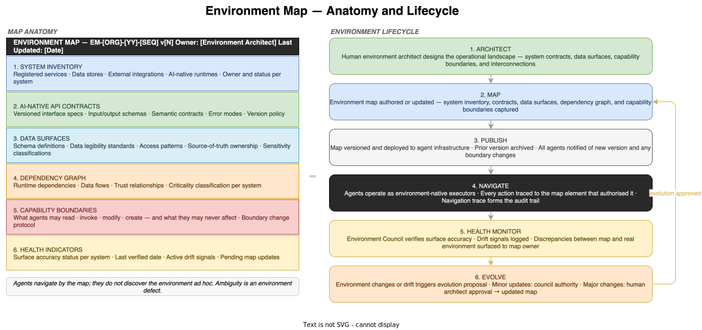

# Environment Map — Reference Design

*E4-06 · Wave 3 — Artefacts · Audience: Architects*

---

## Overview

An environment map is the machine-readable model of the operational landscape — the instrument by which agents at Stage 6 navigate the world they operate in. It captures what systems exist, what they expose, how they interconnect, what agents may and may not do within them, and whether the model currently reflects reality.

The environment map is the primary artefact of Stage 6 (Environment Engineering). Its existence signals a fundamental shift in how the organisation relates to its infrastructure. At earlier stages, agents are adapted to work around opaque or inconsistently specified systems — the environment is a given and the agent must cope with it. At Stage 6, the organisation redesigns the environment itself to be inherently legible, navigable, and safe for AI. The environment map is both the product of that redesign and the instrument that enables agents to operate within it fluently. Agents do not discover the environment ad hoc; they navigate by the map.

---

## What the Map Models

The environment map comprises six components. Together they give agents everything they need to operate within the environment correctly: what exists, what it does, how it connects, what they may touch, and whether the model is current.

### 1. System Inventory

The ground truth of what exists in the operational landscape.

Each system entry contains:

| Field | Description |
|---|---|
| System ID | Unique identifier referenced in all agent navigation records |
| Name and description | Human-readable name and purpose |
| Type | Service · Data store · Queue · External integration · AI-native runtime |
| Owner | The team responsible for maintaining the system |
| Status | Active · Deprecated · Retired |
| Version | The current deployed version |
| Classification | Internal · External · Regulated · AI-native |

If a system is not in the inventory, agents have no authorised basis for interacting with it. An agent that encounters an unregistered system reports it as a discovery event and halts interaction until the system is assessed and either registered or excluded.

### 2. AI-Native API Contracts

The versioned interface specifications that define each system's exposed surface. These are not conventional API documentation — they are designed from the ground up for agent consumption, where clarity is a first-class design requirement.

Each contract contains:

- **Method and endpoint definitions** with precise, schema-typed input and output definitions — no implicit types, no ambiguous field names
- **Semantic contracts** — what the operation actually does, expressed in terms agents can reason about (not just what it returns, but what state it changes, what it assumes about preconditions, and what guarantees it makes about postconditions)
- **Error modes and handling** — not just error codes but what each error means and what the agent should do when it occurs: retry, rollback, escalate, or halt
- **Rate limits and idempotency guarantees** — agents need to know whether repeating a call is safe and under what conditions
- **Consistency model** — what the agent can rely on about the freshness and completeness of returned data
- **Version policy** — which fields and behaviours may change between versions, and how long prior versions will be supported before retirement

An ambiguous contract is an environment defect. If an agent cannot determine from the contract alone what to do in a given case, the contract is incomplete and must be updated before agents are expected to handle that case correctly.

### 3. Data Surfaces

The data models and legibility standards that govern agent access to information.

- **Schema definitions** for all data structures agents may read or write — typed, versioned, with nullability and constraint definitions explicit
- **Data legibility standards** — conventions that apply across all data surfaces: field naming patterns, unit conventions, timestamp formats, enumeration values
- **Access patterns** — how data is intended to be read and written: query patterns that are supported, pagination conventions, write guarantees
- **Source of truth ownership** — which system is the authoritative source for each data entity; when two systems hold copies of the same data, agents know which to trust
- **Sensitivity classifications** — what data categories exist (PII, financial, regulated, public) and what agent operations are permitted on each category

Data surface definitions make agents' interactions with data predictable and correct. Without them, agents must infer data semantics — a brittle approach that produces incorrect behaviour at the edges.

### 4. Dependency Graph

The inter-system relationships that give agents second-order visibility into the consequences of their actions.

- **Runtime dependencies** — which systems call which, in what order, and with what failure modes; if system A calls system B, and B is degraded, what happens to A?
- **Data flows** — how data moves through the landscape: the path from source systems through transformations to consuming systems
- **Trust relationships** — which systems may authenticate on behalf of which others; the graph of delegated access authority
- **Criticality classification** — the operational impact of each system's unavailability: Critical (outage immediately affects end users) · High (degraded service) · Medium (internal impact only) · Low (non-production or non-critical path)

An agent that modifies a system without understanding its downstream dependencies may produce correct output for the immediate task while breaking a downstream consumer. The dependency graph makes those relationships explicit so agents can reason about ripple effects before acting.

### 5. Capability Boundaries

The operational jurisdiction of agents within the environment. These are the environment-level equivalent of the specification corpus's hard constraints — they are enforced, not optimised.

The capability boundary map defines, per system and per agent type:

| Permission tier | Description |
|---|---|
| Read | Agent may query and retrieve data |
| Invoke | Agent may call operations that do not modify persistent state |
| Modify | Agent may create, update, or delete state — subject to specification corpus rules |
| Restricted | Agent may not interact with this system or component |
| Conditional | Interaction requires council deliberation before execution |
| Approval-gated | Interaction requires explicit human approval |

Capability boundaries also define:
- **Ethical envelope** — categories of action that are permanently outside agent authority regardless of other approvals (e.g. irreversible deletion of production data without audit record)
- **Regulatory perimeter** — access restrictions derived from regulatory obligations (e.g. no cross-border data transfer without compliance clearance)
- **Boundary change protocol** — the governance process for expanding or contracting the capability boundary; who can propose changes and who can approve them

An agent that reaches a capability boundary halts and follows the council or human approval pathway, depending on the boundary classification. There is no agent discretion at a capability boundary.

### 6. Health Indicators

The operational status of the map as a live model of reality. Health indicators are what distinguish an environment map from a static architecture diagram.

| Indicator | Description |
|---|---|
| Surface accuracy status | Per-system status: Verified · Unverified · Drift detected · Retired |
| Last verified date | When the surface was last confirmed to match the map description |
| Active drift signals | Specific discrepancies between the map and observed system behaviour |
| Environment health score | Aggregate metric derived from surface accuracy across all systems |
| Pending map updates | Changes in the real environment not yet reflected in the current map version |

Agents treat health indicators as operational signals. A system marked **Drift detected** is treated with caution: the agent reduces reliance on the map's description of that system and either waits for a verified map update or escalates to the Environment Council before proceeding with actions that depend on the affected surface. A map entry with stale health indicators is more dangerous than a known gap — it gives agents false confidence.

---

## Agent Operation

### Navigation

Agents at Stage 6 operate as environment-native executors. The map is not a reference document they consult occasionally — it is their continuous operational context. Before taking any action, an agent resolves its intent against the map:

1. Is the target system in the inventory and active?
2. Does the capability boundary permit this operation?
3. What does the API contract specify for this call — inputs, outputs, error handling?
4. What is the health status of this surface — is the map current?
5. What downstream dependencies are affected by this action?

This resolution happens at each step of execution. Every agent action is traced to the map element that authorised it: which system it accessed (inventory ID), which contract it followed (contract version), which capability tier applied. This navigation trace is part of the audit trail and is the primary evidence of environment-governed operation.

### Boundary Enforcement

When an agent reaches a capability boundary — an operation the map marks as beyond its current jurisdiction — it halts immediately and refers the decision to the appropriate authority:

- **Conditional** operations → council deliberation before proceeding
- **Approval-gated** operations → human approval required
- **Restricted** operations → halt and log; these cannot be unlocked without a boundary change through governance

Reaching a capability boundary is not an error — it is the correct behaviour. An agent that proceeds past a boundary without authorisation has violated the environment governance, regardless of whether the underlying action was harmless.

### Health-Aware Execution

Agents check the health status of each system before acting on it. If a surface is marked unverified or drift-detected, the agent:

- Does not rely on cached descriptions of that system's behaviour
- Reduces autonomous action scope in that system
- Escalates to the Environment Council if the task cannot be safely deferred

This caution is by design. The value of the environment map depends entirely on its accuracy. An agent that ignores health signals and proceeds on the basis of a stale map description becomes an unpredictable actor — exactly what the environment governance is designed to prevent.

---

## Environment Lifecycle

### Architect → Map → Publish → Navigate → Health Monitor → Evolve

**1. Architect**
The human environment architect designs the operational landscape: what systems will exist, what contracts they will expose, how they will interconnect, what capability boundaries agents will operate within. This is not configuration management — it is system design where agent legibility is a primary architectural quality, on par with performance and reliability. An environment that is accurate, consistent, and unambiguous is as much an architectural achievement as an environment that is fast and resilient.

**2. Map**
The designed environment is captured in the environment map. For new environments, this is first authoring. For existing environments being evolved, it is targeted updating. The map is authored by humans or by the Environment Council under human direction. The completeness standard: an agent working only from this map should be able to navigate the entire environment without encountering anything that surprises it. Surprise is a map quality failure.

**3. Publish**
The validated map is versioned and deployed to the agent infrastructure. All agents are notified of the new version and, critically, of any capability boundary changes that may affect in-flight tasks. Prior versions are archived. In-flight workflows at the time of a version transition continue under the version that was active when they started; they are migrated to the new version at the next safe checkpoint.

**4. Navigate**
Agents operate as environment-native executors. The navigation trace produced during this step — every system accessed, every contract invoked, every capability boundary consulted — is logged to the audit trail and forms the primary record of how the environment was used. This trace is also the source material for health monitoring in step 5.

**5. Health Monitor**
The Environment Council continuously verifies that the map accurately models the real environment. Verification methods include: automated probing of API contracts against live system behaviour, schema validation against live data samples, dependency graph consistency checks against runtime call logs. Discrepancies are logged as drift signals and surfaced to the map owner. A high drift rate indicates the real environment is changing faster than the map evolution process can track.

**6. Evolve**
When the environment changes — new systems onboarded, contracts updated, capability boundaries revised, or accumulated drift corrected — the Environment Council proposes an evolution. The approval authority depends on the scope of the change:

| Change type | Approval authority |
|---|---|
| Health indicator reset (drift resolved) | Environment Council (delegated) |
| Contract patch (non-breaking clarification) | Environment Council (delegated) |
| New system registration | Map owner + owning team |
| Capability boundary change | Human architect approval required |
| New domain or architectural restructuring | Human architect approval required |
| System retirement | Map owner + dependent team sign-off |

Approved evolutions enter the Map step, producing a new version. The feedback loop from Evolve to Map (not back to Architect) reflects the distinction between ongoing map maintenance and ground-up environment design.

---

## Authoring Principles

**The map is the source of truth, not a reflection of it.** If the environment and the map diverge, the map is wrong. Agents are not expected to reconcile observed system behaviour with map descriptions — that is the Environment Council's role. An agent that discovers a discrepancy reports it; it does not adapt.

**Ambiguity is an environment defect.** A system or contract entry that an agent cannot act on without additional context is incomplete. The test of a well-formed map entry: an agent with no prior knowledge of this system should be able to interact with it correctly on first encounter, using only the map. If it cannot, the map entry needs work.

**Capability boundaries are absolute.** Like the specification corpus's hard constraints, capability boundaries are enforced, not optimised. An agent that would produce a better outcome by crossing a boundary must still halt. The boundary exists because the organisation decided the potential downside of unrestricted access outweighs the upside of unconstrained action. That decision is embedded in the boundary; agents do not re-evaluate it.

**Health is a first-class map property.** A map entry without current health indicators is incomplete. The map's operational value depends on its accuracy, and accuracy requires continuous verification. Health monitoring is not an optional add-on; it is integral to what makes an environment map different from a static architecture document.

**Evolution is expected, not exceptional.** Environments change — contracts evolve, systems are added and retired, capability boundaries are revised as the organisation gains experience. A map that has not been updated in six months is almost certainly stale. The governance process must make map evolution as low-friction as possible, or the organisation faces environment ossification — the map becoming a legacy artefact that agents navigate around rather than by.

---

## Environment Ossification — The Stage 6 Risk

The primary Stage 6 risk is environment ossification: the AI-native environment that the organisation designed and mapped becomes static, while the world it was designed to serve continues to change. The map diverges from reality. Agents navigating by the map produce increasingly unreliable outcomes. The Dark Factory's governance guarantees erode at the infrastructure level.

Ossification is insidious because it looks like the system is working — agents are consulting the map, following contracts, respecting capability boundaries — but the map describes a past state, not the present one. The failures that result are difficult to trace: they look like agent errors rather than map quality failures.

Four mitigations:

1. **Scheduled review cadence** — the environment map has a mandatory review on a fixed schedule, independent of whether drift has been detected. The review asks: does this map still describe the environment we intend agents to operate in? Have any systems changed in ways not yet reflected?

2. **Drift rate as a leading indicator** — the rate at which new drift signals are generated is a forward-looking health metric. A rising drift rate means the real environment is changing faster than the map can track; the solution is to increase the velocity of the evolution cycle, not to ignore the signals.

3. **Delegated evolution authority** — giving the Environment Council authority to apply patch-level map updates without human approval dramatically reduces the friction of keeping the map current. If every map update required architect sign-off, small corrections would queue up until the map was significantly stale. Delegated authority for non-boundary changes lets the map stay current continuously.

4. **Retirement protocol** — when a system is decommissioned, its map entry transitions to **Retired** status before removal. Agents holding references to the retired entry are notified immediately and redirect accordingly. The retirement path is as explicit and governed as the registration path. Systems that simply disappear from the map without a retirement record are a governance failure.

---

> **Related items:** E4-04 Specification Corpus · E4-03 Intent Manifest — Reference Design · E4-01 Artefact Catalogue · E3-03 Agent Council Design · E3-05 The Meta-Council
