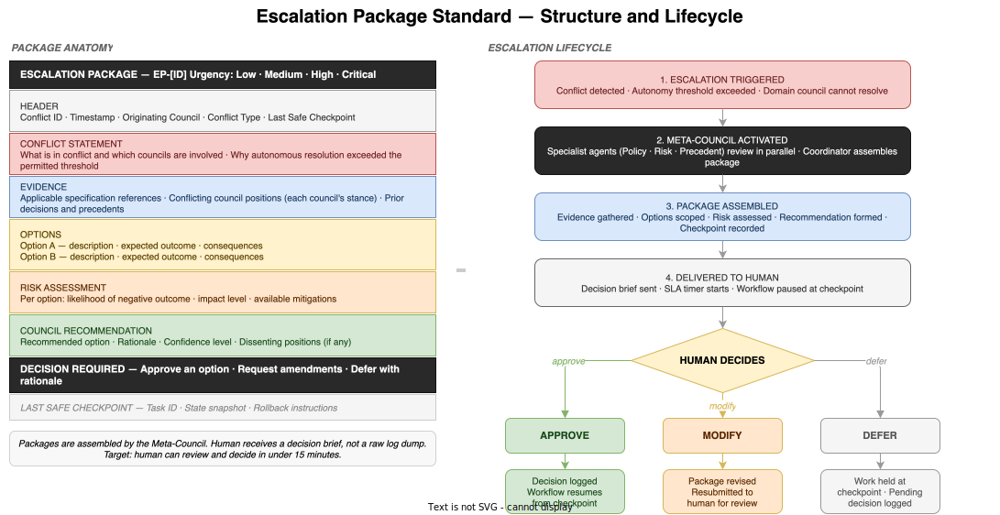

# Escalation Package Standard

*E4-05 · Wave 3 — Artefacts · Audience: All*

---

## Overview

An escalation package is the structured evidence bundle that an Agent Council prepares and delivers to a human when a conflict cannot be resolved within the bounds of the specification corpus. It is not a raw log or a status update — it is a **decision brief**: a pre-packaged, human-ready document that gives the recipient everything they need to make a decision in minutes, not hours.

The quality of escalation packages is one of the most visible indicators of Dark Factory maturity. Poor packages overwhelm humans with raw data. Well-formed packages frame the conflict clearly, present costed options, and include a recommendation. The human's cognitive load is minimised; their decision authority is respected.

---

## When Escalation Is Triggered

Escalation is not failure. It is the correct behaviour when:

1. **Specification conflict** — two or more applicable specifications contradict each other and the Meta-Council cannot determine which takes precedence
2. **Novel situation** — the scenario has no applicable specification and no prior ruling, so there is no authoritative basis for an autonomous decision
3. **Risk threshold exceeded** — the options available all carry risk above the envelope defined in the requirements
4. **Charter boundary dispute** — two domain councils disagree on which has authority over a decision domain

An escalation that does not meet one of these criteria is an agent error — the system is over-escalating. Unnecessary escalations undermine the purpose of the Dark Factory. The escalation threshold must be calibrated: too high and humans miss real conflicts; too low and the Dark Factory reverts to human-in-the-loop operation.

---

## Package Structure

### 1. Document Header

| Field | Description |
|---|---|
| Package ID | Unique identifier (EP-[YYYYMMDD]-[seq]). Used to reference this package in decision logs, audit trails, and cross-references. |
| Timestamp | When the package was created by the Meta-Council. |
| Originating Council | The domain council that first detected the conflict and triggered escalation. |
| Conflict Type | Specification conflict · Novel situation · Risk threshold exceeded · Charter boundary dispute |
| Urgency | Low · Medium · High · Critical. Determines the SLA for human response. |
| Last Safe Checkpoint | The task ID and state from which the workflow can resume safely regardless of which option the human chooses. |

### 2. Conflict Statement

Two fields only:

1. **What is in conflict** — a clear, jargon-free statement of the conflict: which specifications or positions are at odds, and what the practical consequence of each is
2. **Why autonomous resolution failed** — the specific reason the Meta-Council cannot resolve this: which rule was exceeded, which authority is unclear, which risk threshold was breached

The conflict statement must be written for the human recipient, not for the agent system. It should require no background knowledge beyond the materials in the package itself.

### 3. Evidence

| Field | Description |
|---|---|
| Specification references | The IDs and relevant excerpts from the specification corpus that apply. Not the full spec — the specific clauses in conflict. |
| Conflicting council positions | Each domain council's stated position on the conflict. What each council argues, and why. |
| Prior decisions and precedents | Any prior Meta-Council rulings or human decisions that are analogous to this case. Precedents reduce the human's need to reason from first principles. |

### 4. Options

Each option presented as:
- **Description** — what this option entails
- **Expected outcome** — what the workflow produces if this option is chosen
- **Consequences** — what is gained and what is sacrificed (e.g. speed vs. compliance, coverage vs. cost)

A well-formed escalation package presents between two and four options. Fewer than two means the council has already decided and is seeking ratification (over-escalation). More than four means the problem has not been adequately framed — the council is offloading analysis onto the human.

Options must be mutually exclusive. Hybrid options may be presented only if they are actionable as stated.

### 5. Risk Assessment

For each option:

| Field | Description |
|---|---|
| Likelihood | Probability that the negative consequence occurs: Low · Medium · High |
| Impact | Severity of the negative consequence if it occurs: Low · Medium · High · Critical |
| Available mitigations | Steps that could reduce likelihood or impact if this option is chosen |

The risk assessment is not an opinion — it is derived from the specification corpus's risk classification rules and from historical data in the system's telemetry baselines.

### 6. Council Recommendation

| Field | Description |
|---|---|
| Recommended option | Which option the Meta-Council recommends and why |
| Rationale | The reasoning: which specification, precedent, or principle drives the recommendation |
| Confidence level | The Meta-Council's confidence in the recommendation: Low · Medium · High |
| Dissenting positions | Any specialist agent (Policy · Risk · Precedent) that disagreed with the recommendation, and their reasoning |

The recommendation is advisory. The human may reject it. When the human consistently rejects council recommendations without explanation, this is a signal that either the intent manifest needs updating or the Meta-Council's reasoning is miscalibrated.

### 7. Decision Required

A single, unambiguous statement of what the human must choose:

> *Choose one option (A, B, or C), request package amendments with specific questions, or defer with a rationale and target resolution date.*

This field must require a choice, not an analysis. If a human reads the Decision Required field and is uncertain what action to take, the package is malformed.

### 8. Last Safe Checkpoint

The state of the workflow at the point escalation was triggered, including:
- Task ID and workflow position
- A snapshot of the system state (what has been completed, what is pending)
- Rollback instructions if needed

The checkpoint ensures that whatever decision the human makes, the workflow can resume cleanly. It also ensures that a deferred decision does not result in partial or inconsistent state.

---

## Lifecycle

### Trigger → Assembly → Delivery → Decision → Outcome

**1. Escalation triggered**  
The domain council detects that a conflict exceeds its resolution authority. A conflict record is opened, the last safe checkpoint is logged, and work pauses at that checkpoint.

**2. Meta-Council activated**  
The Meta-Council's specialist agents work in parallel:
- Policy agent identifies the applicable specification authority
- Risk agent quantifies the risk of each resolution path
- Precedent agent searches for analogous prior decisions
- Packaging agent assembles the draft package

**3. Package assembled**  
The Coordination agent reviews the specialist inputs, finalises the options, writes the recommendation, and packages the document. Assembly target: minutes, not hours. An escalation package that takes longer than 30 minutes to assemble indicates missing specification coverage or an over-scoped conflict statement.

**4. Delivered to human**  
The package is delivered through the organisation's designated escalation channel (dashboard notification, ticketing system, or direct message depending on urgency level). An SLA timer starts. The urgency level determines the response SLA:

| Urgency | SLA |
|---|---|
| Low | 48 hours |
| Medium | 8 hours |
| High | 2 hours |
| Critical | 15 minutes |

**5. Human decision**

The human has three choices:

| Decision | Description |
|---|---|
| **Approve** | Selects one option. Decision is logged with the rationale (or the absence of one). Workflow resumes from the last safe checkpoint. |
| **Modify** | Requests amendments to the package: specific questions, additional options, or more evidence. Package is returned to the Meta-Council for revision. |
| **Defer** | Acknowledges the package but cannot or will not decide now. Provides a target resolution date and rationale. Work remains held at checkpoint. |

**6. Outcome recorded**  
All decisions are logged in the audit trail as Human Decision Records. These records are used to:
- Resume the workflow (Approve)
- Guide package revision (Modify)
- Update the Precedent agent's knowledge base (all decisions)
- Identify patterns in escalation frequency that signal intent drift or specification gaps

---

## Design Principles

**Human cognitive load is the design constraint.** A human reviewer who has received twenty escalation packages in a week will pattern-match and satisfice. Package design must assume reviewer fatigue: clear conflict statement, options not longer than a paragraph each, recommendation explicit.

**The package is evidence, not justification.** The council presents what it found, not a case for what the human should decide. Advocacy packages that construct a one-sided argument should be treated as a calibration failure.

**Silence is not consent.** If a human does not respond within SLA, the system must not proceed. The workflow stays held at checkpoint until a decision is received. Automatic approval after timeout is not permitted — it would undermine the purpose of the escalation mechanism.

**Every package improves the system.** Human decisions that contradict the council recommendation are gold: they reveal either a gap in the specification corpus or a miscalibration in the council's reasoning. Both are fixable. Escalation packages that are never reviewed or where decisions are never explained are a governance failure.

---

> **Related items:** E3-03 Agent Council Design · E3-05 The Meta-Council · E4-04 Specification Corpus · E4-01 Artefact Catalogue
