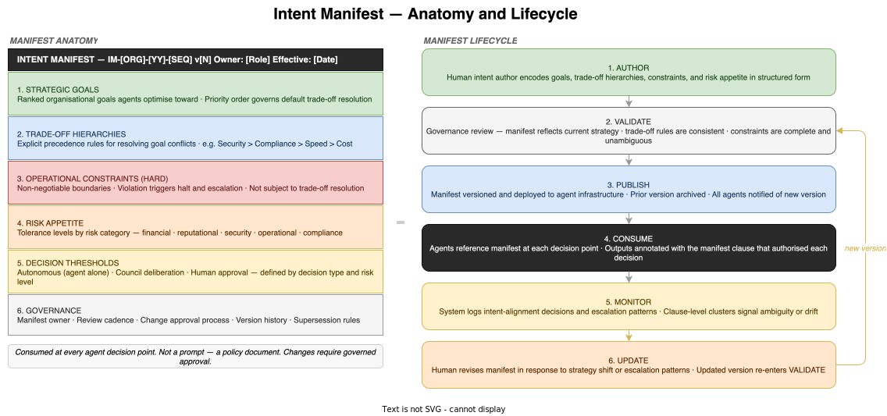

# Intent Manifest — Reference Design

*E4-03 · Wave 3 — Artefacts · Audience: All*

---

## Overview

An intent manifest is a structured, machine-readable document that encodes what an organisation values, how it resolves conflicts between competing goals, and what boundaries it will not cross. Agents reference it at every decision point. It is not a prompt — it is a policy document.

Before the intent manifest exists, agents act on task instructions alone. They have no awareness of whether a decision serves the organisation's strategic priorities or conflicts with its risk appetite. The intent manifest changes that. It is the primary instrument of intent governance at Stage 3 and the artefact that makes the transition from task-oriented execution to intent-aware operation possible.

The difference is significant. An agent working from task instructions can complete the task. An agent working from an intent manifest can ask — and answer — whether completing the task in a particular way actually serves the organisation's goals. That capability is what Stage 3 introduces, and the intent manifest is its enabling artefact.

---

## Purpose

The intent manifest serves three functions:

1. **Direction** — it tells agents what to optimise for, in priority order, so that decisions made at execution time reflect organisational strategy rather than local task logic
2. **Adjudication** — it provides explicit rules for resolving conflicts between goals without human intervention, reducing unnecessary escalation
3. **Governance** — it creates an auditable record of what the organisation encoded as its intent, enabling retrospective review of whether agent decisions were appropriately authorised

---

## Document Structure

### Document Header

| Field | Description |
|---|---|
| Manifest ID | Unique identifier (IM-[ORG]-[YY]-[SEQ]). Referenced in intent-annotated outputs and audit records. |
| Version | Semantic version (v1.0, v1.1, v2.0). Every published change increments the version. |
| Owner | The role responsible for maintaining the manifest. Typically the Lead Intent Author or equivalent governance function. |
| Effective Date | When this version becomes active across the agent infrastructure. |
| Review Cadence | Scheduled review frequency (e.g. quarterly). |
| Supersedes | The manifest ID and version this document replaces, if any. |

---

### 1. Strategic Goals

The ranked list of organisational goals that agents optimise toward. Each goal entry contains:

- **Label** — a short, precise name (e.g. "Maintain SLA compliance", "Minimise time-to-market")
- **Priority rank** (P1–Pn) — agents resolve ambiguity in favour of higher-ranked goals when the trade-off hierarchy does not provide a more specific rule
- **Definition** — a concrete statement of what success looks like; written so that a decision outcome can be evaluated against it
- **Metric** — how alignment is measured, where measurable (e.g. "SLA breach rate < 0.5% per quarter")
- **Scope** — which domains, workflows, or agent types this goal applies to

The ranked order is significant. It is the tiebreaker when a trade-off rule has not been defined for a specific conflict. Goal rank is not a preference; it is the organisation's stated priority order.

---

### 2. Trade-Off Hierarchies

Explicit precedence rules for resolving conflicts between strategic goals. Written as ordered propositions with defined scope:

> Security > Compliance > Speed > Cost

Each trade-off rule states:
- Which goal takes precedence when both are relevant to the same decision
- The **scope** of the rule — which decision types or domains it applies to
- **Exceptions**, if any — situations where the rule is overridden by a more specific rule

Trade-off rules prevent the most common class of intent conflict: agents that correctly identify multiple applicable goals but have no basis for choosing between them. The hierarchy encodes the organisation's preference explicitly, so agents can resolve the conflict autonomously and annotate the resolution with the rule that authorised it.

A trade-off hierarchy that is incomplete — that has gaps for combinations of goals that regularly arise in practice — will produce escalations at those gaps. Escalation patterns clustered around specific goal combinations are evidence that a rule needs to be added.

---

### 3. Operational Constraints (Hard)

Non-negotiable boundaries that agents may not cross, regardless of goal alignment. Hard constraints are not subject to trade-off resolution; they are enforced. A decision that maximises goal achievement but violates a hard constraint must halt and escalate.

Each constraint entry contains:
- **Statement** — what is prohibited or required, written in concrete, unambiguous terms with no wiggle room
- **Authority** — the source that defined this constraint: legal obligation, regulatory requirement, board policy, or security mandate
- **Consequence of violation** — the required system response: halt, rollback, escalation type, and to whom

The distinction between hard constraints and goals matters for agent behaviour. Goals are optimised — agents trade one against another using the trade-off hierarchy. Constraints are enforced — agents cannot trade around them. A constraint that admits exceptions or requires judgement is not a hard constraint; it belongs in Section 2 as a scoped trade-off rule.

---

### 4. Risk Appetite

The organisation's tolerance for different categories of risk, used by agents and councils to determine whether a decision is within autonomous authority.

| Risk Category | Appetite | Definition |
|---|---|---|
| Financial | Medium | Expenditure decisions within defined limits accepted autonomously; above threshold escalates |
| Reputational | Low | Any decision with public-facing impact escalates to council deliberation |
| Security | Very Low | Any potential exposure to data breach or access compromise triggers halt |
| Operational | Medium | Degraded service acceptable; full outage escalates to human approval |
| Compliance | Very Low | Any decision that creates regulatory exposure escalates immediately |

Risk appetite integrates with Section 5 (Decision Thresholds) to define the autonomy boundary precisely. A decision whose risk profile exceeds the stated appetite for its category cannot be resolved autonomously — the agent must refer it upward, to council deliberation or human approval depending on severity.

---

### 5. Decision Thresholds

The manifest defines three tiers of decision authority, drawn from the risk appetite and constraint definitions:

| Tier | Authority | Scope |
|---|---|---|
| **Autonomous** | Agent decides without consultation | Implementation choices within specification, routine test execution, low-risk deployment actions within stated operational parameters |
| **Council deliberation** | Agent Council deliberates and reaches consensus | Architecture decisions, cross-system changes, decisions that touch risk-appetite boundaries, novel situations with precedent but no direct specification coverage |
| **Human approval** | Human must approve before proceeding | Decisions that touch a hard constraint, high-reputational-risk actions, strategic reversals, situations with no prior precedent |

Thresholds are defined by decision type, impact level, and risk category. The threshold table is the primary mechanism by which the manifest governs autonomous behaviour: it tells agents not just what to optimise for, but how far they can go before stopping.

---

### 6. Governance

| Field | Description |
|---|---|
| Owner | The role responsible for keeping the manifest current and initiating reviews |
| Review cadence | Scheduled review frequency — e.g. quarterly, or after any major strategic change |
| Change approval | The authority required to amend each section — some sections (hard constraints) may require board-level sign-off; others (goal metrics) may be delegated to the Lead Intent Author |
| Version history | A record of prior versions, what changed, why, and when |
| Supersession rules | How agents handle version transitions — when a new version takes effect, what happens to decisions mid-flight under the old version |

---

## Lifecycle

### Author → Validate → Publish → Consume → Monitor → Update

**1. Author**  
The human intent author encodes the organisation's goals, trade-off hierarchies, constraints, and risk appetite. This is a governance exercise, not a technical one. It requires active engagement with strategy owners, legal, risk, and operations to ensure the manifest is accurate and complete. The intent author role is a Stage 3 role that does not exist in earlier stages; it is the human contribution that makes agent-level intent awareness possible.

**2. Validate**  
Before publication, the manifest is reviewed by a governance board or designated authority. Validation checks: does the manifest accurately reflect current organisational strategy? Are the trade-off hierarchies internally consistent and exhaustive for known decision domains? Are the hard constraints complete, unambiguous, and enforceable as written? Validation is the gate that prevents a stale or internally inconsistent manifest from being deployed to the agent infrastructure.

**3. Publish**  
The validated manifest is versioned and deployed. The prior version is archived but remains accessible for audit — decisions made under prior versions must remain traceable to the manifest version that was active at the time. All agents are notified that a new version is active.

**4. Consume**  
Agents reference the manifest at each decision point. Every output produced under manifest authority carries intent annotations: which manifest clause governed the decision, what the agent's reasoning was, and how the decision was scored against the relevant goals. These annotations are the basis for intent-alignment testing and retrospective audit.

**5. Monitor**  
The system logs all intent-alignment events: decisions taken within manifest authority, escalations triggered by manifest conflicts, and cases where agents flagged ambiguity in the manifest itself. Escalation patterns that cluster around specific clauses are diagnostic: they indicate either that the clause is ambiguous (a drafting problem) or that it no longer reflects current practice (a drift problem).

**6. Update**  
When monitoring reveals intent drift, or when organisational strategy changes, the manifest is revised. Every update re-enters the Validate step before publication. The change approval process defined in Section 6 governs who can change what. The audit trail preserves the full version history, ensuring that every decision ever made under any version of the manifest remains traceable to the governing document.

---

## Authoring Principles

**Precision beats completeness.** A manifest with twenty vague goals is less useful than one with five precise ones. Agents cannot act on goals that are ambiguous. If a goal cannot be stated in a way that a decision outcome could be evaluated against it, it is not ready to be encoded.

**Trade-off rules must be decisive within scope.** A rule that says "generally prefer security over speed" is not a trade-off rule — it is an aspiration. Rules must be binary within their defined scope: when both goals apply to this class of decision, this one wins.

**Hard constraints must be enforceable as written.** A constraint that admits exceptions or requires judgement is not hard — it is a scoped policy that belongs in the trade-off section. Hard constraints must be stated so that a system can determine, without additional context, whether a proposed action violates them.

**The manifest is a policy document, not a prompt.** It should be written like a policy: precise, structured, unambiguous. It does not explain why the organisation holds the values it does — that reasoning belongs in the governance record. The manifest encodes what has been decided, not the deliberation that led there.

**Silence is a gap.** If a class of decision arises that the manifest does not address, agents have no authoritative basis for resolving it. Systematic escalations around a class of decision indicate a manifest gap, not an agent error. The correct response is to add coverage, not to calibrate agents to make arbitrary choices.

---

## Intent Drift

The primary Stage 3 risk is intent drift: the manifest becomes stale as organisational strategy evolves, but agents continue to act against the outdated version. Unlike a bug, intent drift produces no immediate error. Agents continue to operate. Decisions continue to be made. But the decisions are increasingly misaligned with what the organisation actually wants. By the time the drift is detected, a significant backlog of misaligned outputs may exist.

Four mitigations:

1. **Scheduled review cadence** — the manifest is reviewed at a fixed interval regardless of whether problems are visible. Quarterly is the minimum; organisations with rapidly evolving strategy may need monthly.
2. **Strategy change triggers** — a governed process that requires manifest review whenever organisational strategy changes. The review trigger is embedded in the change management process, not left to the intent author to remember.
3. **Escalation pattern monitoring** — clusters of escalations around a specific manifest clause are a leading indicator of drift. The monitoring system surfaces these patterns; the intent author investigates.
4. **Intent-alignment audits** — periodic audits of intent-annotated outputs to check whether the manifest's goals and hierarchies reflect actual decision-making intent. Audits compare what the manifest says the organisation values against the pattern of decisions that were approved.

---

> **Related items:** E4-01 Artefact Catalogue · E4-02 Requirements Specification Templates · E4-04 Specification Corpus · E3-03 Agent Council Design · E3-05 The Meta-Council
