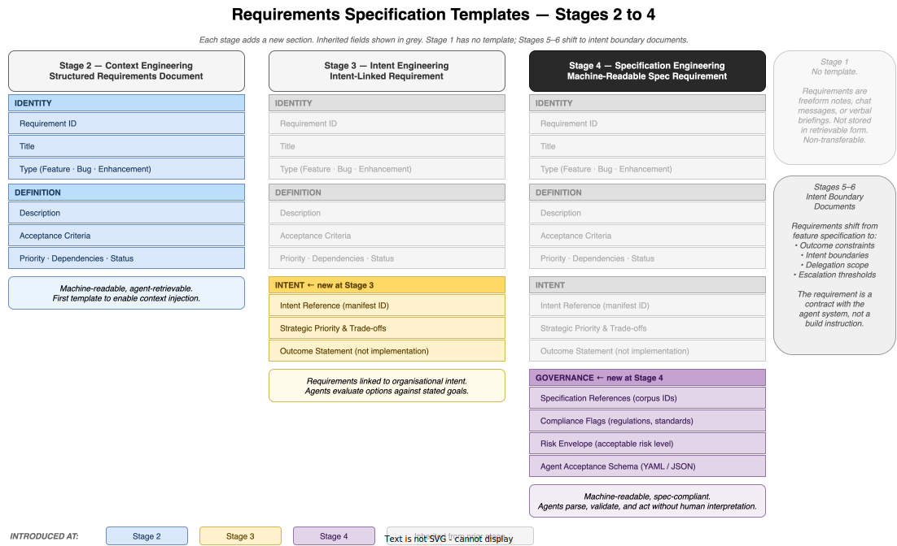

# Requirements Specification Templates

*E4-02 · Wave 3 — Artefacts · Audience: All*

---

## Overview

Requirements are the one artefact that humans author at every stage of the maturity framework. What changes is not whether humans write them — it's **what form they take**, **how much structure they carry**, and **who consumes them**.

At Stage 1, a requirement is a sentence in a chat window. At Stage 4, it is a machine-readable document that agents parse, validate against specifications, and act upon without human interpretation. This document describes the template structure at each stage, what fields are introduced and why, and how to read the evolution as deliberate design rather than bureaucratic accumulation.



---

## Stage 1 — No Template

Requirements at Stage 1 are captured in whatever form is convenient: a Jira ticket with a freeform description, a Slack message, a verbal briefing, or a rough note in a shared document. There is no standard structure.

**Consequence:** requirements are person-dependent and non-transferable. They are not structured for agent retrieval, cannot be linked to goals, cannot be audited, and cannot be consumed by any automated process. All knowledge lives in the human author's head.

This is not a failure of process — it is an accurate reflection of Stage 1 maturity. The discipline of structuring requirements is itself a Stage 2 capability.

---

## Stage 2 — Structured Requirements Document

*First introduction of a formal template. Purpose: machine-retrievability and human consistency.*

### Template

**IDENTITY**
| Field | Description |
|---|---|
| Requirement ID | Unique identifier. Used by agents to retrieve and reference this requirement. |
| Title | Short label for the requirement. Used in logs, dashboards, and agent task queues. |
| Type | Feature · Bug · Enhancement. Signals what kind of work this drives. |

**DEFINITION**
| Field | Description |
|---|---|
| Description | Natural language statement of what is needed. Freeform but bounded. |
| Acceptance Criteria | List of conditions that must be true for the requirement to be considered met. |
| Priority · Dependencies · Status | Priority (P1–P4), links to blocking or enabling requirements, workflow state. |

### Why this template matters

The critical change from Stage 1 is **machine-retrievability**. A structured requirements document can be stored in a system that agents query. At Stage 2, agents need access to requirements to perform context injection — they retrieve the relevant requirements before executing a task. Without a consistent structure, retrieval is unreliable.

The acceptance criteria field is particularly important: it is the first attempt to define "done" in a form that can be evaluated systematically, even if the evaluation at this stage remains human.

### What this template does not yet capture

- Why this requirement matters to the business
- Which organisational goals it serves
- What the acceptable trade-offs are
- Who (human or agent) is allowed to make decisions about it

These are Stage 3 concerns.

---

## Stage 3 — Intent-Linked Requirement

*Adds an Intent section. Purpose: agents can evaluate options against goals, not just execute tasks.*

### Template

**IDENTITY** *(inherited from S2)*  
**DEFINITION** *(inherited from S2)*

**INTENT** *(new at Stage 3)*
| Field | Description |
|---|---|
| Intent Reference | The ID of the intent manifest clause(s) this requirement serves. Links the requirement to the organisation's stated goals. |
| Strategic Priority & Trade-offs | Which priorities govern this requirement (e.g. speed over cost, correctness over coverage). Tells agents how to adjudicate when options conflict. |
| Outcome Statement | What must be true in the world when this requirement is complete. Stated as an outcome, not an implementation. |

### Why this template matters

Stage 3 introduces the key shift from **task specification** to **intent specification**. A pure task specification tells an agent what to build. An intent-linked requirement tells an agent *why* — and in doing so, enables the agent to make decisions that serve the goal even when the exact task turns out to be the wrong one.

The Outcome Statement is the most important new field. It forces the author to separate *what they want to achieve* from *how they think it should be achieved*. This separation is what allows agents to propose alternatives, identify better paths, and challenge requirements that would not actually produce the stated outcome.

The Intent Reference field connects individual requirements to the organisation's intent manifests. This is the infrastructure that enables intent-alignment testing at Stage 3: automated checks that ask not just "does this pass the tests?" but "does this serve the stated goal?"

### What this template does not yet capture

- Which formal specifications must be satisfied
- What the compliance obligations are
- What risk level is acceptable
- A form that agents can parse and execute without human interpretation

These are Stage 4 concerns.

---

## Stage 4 — Machine-Readable Specification Requirement

*Adds a Governance section. Purpose: agents can consume, validate, and act on requirements without human mediation.*

### Template

**IDENTITY** *(inherited from S2)*  
**DEFINITION** *(inherited from S2)*  
**INTENT** *(inherited from S3)*

**GOVERNANCE** *(new at Stage 4)*
| Field | Description |
|---|---|
| Specification References | The IDs of specification corpus entries that apply to this requirement. Agents validate their outputs against these specs. |
| Compliance Flags | Applicable regulatory frameworks, security controls, brand standards, or operational rules. Agents will not proceed without satisfying these. |
| Risk Envelope | The acceptable level of risk for this requirement (e.g. Low / Medium / High). Defines how much agent autonomy is allowed before escalation is triggered. |
| Agent Acceptance Schema | A machine-readable definition of "done" — typically YAML or JSON — that agents use to evaluate completion without human interpretation. |

### Why this template matters

Stage 4 is where requirements cross the threshold from **human-readable documents** to **agent-executable contracts**. The Governance section provides the formal legal and operational framework within which the Dark Factory operates.

Without specification references, agents implement correctly but may unknowingly violate policy. Without compliance flags, requirements pass through the workflow without triggering the relevant security, legal, or operational checks. Without a risk envelope, the system cannot determine when to proceed autonomously and when to escalate.

The Agent Acceptance Schema is the most technically significant addition. It replaces the natural-language Acceptance Criteria (which agents must interpret) with a formal schema (which agents execute directly). This is the shift that makes autonomous validation possible.

### Example: Agent Acceptance Schema (YAML)

```yaml
acceptance:
  functional:
    - condition: "user_can_authenticate_with_mfa"
      method: "integration_test"
      required: true
    - condition: "fallback_to_sms_if_app_unavailable"
      method: "integration_test"
      required: true
  performance:
    - metric: "auth_latency_p99"
      threshold: "< 2000ms"
  compliance:
    - spec: "SEC-AUTH-002"
      validation: "automated"
    - spec: "GDPR-DATA-001"
      validation: "automated"
  risk_envelope: "medium"
  escalation_trigger: "any_compliance_failure"
```

This schema is consumed directly by the agent test harness. No human interprets it. If all conditions are met, the requirement is considered complete. If any compliance check fails, the escalation trigger fires automatically.

---

## Stages 5–6 — Intent Boundary Documents

At Stage 5 and 6, requirements shift character again. The template no longer specifies a feature or capability — it specifies a **contract between the human and the agent system**.

The primary fields in an Intent Boundary Document are:

| Field | Description |
|---|---|
| Outcome Constraint | What the system must achieve. Measured, not described. |
| Negative Constraint | What the system must never do. Hard limits on agent autonomy. |
| Delegation Scope | The domain in which agents have full authority to act without reference back. |
| Escalation Thresholds | The conditions under which the system must pause and involve a human. |
| Intent Boundary Version | The version of the intent framework this document operates under. |

At Stage 6, the requirement may refer to an environment-level outcome (e.g. "the API surface for the authentication domain must satisfy all legibility standards") rather than a specific feature. The human is writing requirements for the world agents operate in, not for tasks agents must perform.

---

## Template Evolution Summary

| Stage | Template Name | What's New | Key Purpose |
|---|---|---|---|
| S1 | None | — | — |
| S2 | Structured Requirements Document | IDENTITY + DEFINITION | Agent-retrievable, human-consistent |
| S3 | Intent-Linked Requirement | INTENT section | Agents understand goals, not just tasks |
| S4 | Machine-Readable Spec Requirement | GOVERNANCE section | Agents act without human mediation |
| S5–6 | Intent Boundary Document | Outcome + constraint model | Human defines the world; agents own execution |

---

## Authorship

Across all stages, requirements are human-authored. This is not a concession to current AI limitations — it is a deliberate design principle. Requirements encode *intent*, and intent is what humans bring to the system. The role of the templates is to translate human intent into a form that agent systems can act on with confidence.

The progression of template complexity is not bureaucracy. Each new field represents a category of information that the system needs to operate autonomously at the next level of maturity. If a field cannot be filled in, the organisation is not yet ready for the maturity stage that field enables.

---

> **Related items:** E4-01 Artefact Catalogue · E4-03 Intent Manifest — Reference Design · E4-04 Specification Corpus · E4-05 Escalation Package Standard
