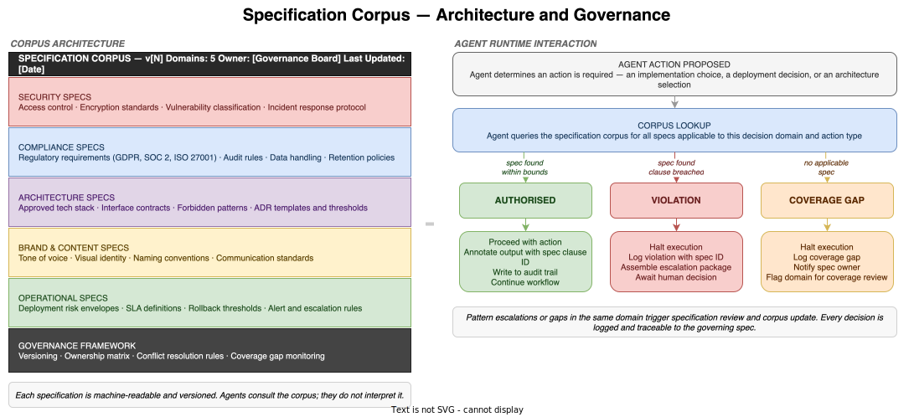

# Specification Corpus — Architecture & Governance

*E4-04 · Wave 3 — Artefacts · Audience: Architects / CTOs*

---

## Overview

The specification corpus is the complete set of machine-readable policies, compliance rules, security controls, brand standards, and operational constraints that govern the Dark Factory. It is the law: agents operate within it, councils enforce it, and every agent decision is annotated with the corpus clause that authorised it.

The corpus is what makes the Stage 4 transition possible. At Stage 3, agents work within an intent manifest — strategic guidance that tells them what to optimise for. At Stage 4, the intent manifest is supplemented by a far more granular instrument: a complete, domain-organised set of specifications that an agent can query at each decision point and receive an unambiguous answer about whether a proposed action is permitted. The Dark Factory runs because agents do not need human approval for routine decisions — they have the specification corpus to consult instead.

---

## What a Specification Is

A specification is a single, machine-readable rule or rule set governing a specific class of agent decision within a defined domain. Each specification contains:

| Field | Description |
|---|---|
| Spec ID | Unique identifier (e.g. SEC-042, COMP-017). Referenced in all agent outputs that invoke this spec. |
| Domain | Which of the five corpus domains this spec belongs to. |
| Version | Semantic version. Increments on every change. Prior versions are archived. |
| Owner | The role or team responsible for maintaining this specification. |
| Effective date | When this version became active. |
| Scope | The decision types, agent types, or system areas this spec applies to. |
| Rule | The specification itself — stated as a verifiable, machine-checkable proposition. |
| Enforcement | What happens when the rule is breached: halt, rollback, escalation type. |
| Conflict priority | How this spec is weighted when it conflicts with a spec from another domain (references the inter-domain conflict resolution rules). |
| Review cadence | When this spec is next scheduled for review. |

The rule field is the critical one. A specification rule must be stated precisely enough that an agent can evaluate a proposed action against it without additional context. A rule that requires interpretation is not a specification — it is a guideline, and guidelines belong in the intent manifest, not the corpus.

---

## Corpus Architecture

The corpus is organised into five domains. Each domain is owned by a distinct group and enforced by the corresponding specialist council at Stage 4.

### Security Specifications

Owned by the Security function. Enforced by the Security Council.

Cover: access control policies (who may access what and under what conditions), encryption requirements (data at rest, data in transit), vulnerability classification standards (which severity levels block deployment), patch management rules, secrets management, and incident response protocols. Security specifications are typically the strictest in the corpus — they carry very low risk appetite and trigger halt-and-escalate on violation without exception.

### Compliance Specifications

Owned by the Legal and Compliance function. Enforced by the Compliance Council.

Cover: regulatory obligations (GDPR, SOC 2, ISO 27001, PCI-DSS, and others applicable to the organisation's operating context), audit trail requirements, data handling and residency rules, retention and deletion policies, and consent frameworks. Compliance specifications are non-negotiable in the same way security specifications are — they are derived from external legal requirements, not internal preference. The organisation cannot trade off compliance against speed.

### Architecture Specifications

Owned by the Architecture function. Enforced by the Architecture Council.

Cover: approved and prohibited technologies (languages, frameworks, infrastructure providers), interface contract standards (API design rules, versioning requirements), service boundary rules (what components may know about what others), forbidden patterns (anti-patterns the organisation has explicitly banned), and Architecture Decision Record templates including the approval thresholds that determine whether a new ADR requires Architecture Council review or can be auto-generated. Architecture specifications define the shape of what agents may build — they constrain the solution space, not the process.

### Brand & Content Specifications

Owned by the Communications or Brand function. Enforced at the appropriate council or directly by content-producing agents.

Cover: tone of voice, visual identity rules, naming conventions, approved terminology, prohibited language, and communication standards for different output types (user-facing, internal, external documentation). Often the lightest in enforcement weight — violations are flagged for review rather than triggering a halt — but essential for organisations where agents produce customer-facing content at scale.

### Operational Specifications

Owned by Platform Engineering and Operations. Enforced by the Deployment Council.

Cover: deployment risk envelopes (what change volume and risk level can be deployed in what time window), SLA definitions and thresholds, rollback trigger conditions, canary deployment rules, alert and escalation routing, and maintenance window constraints. Operational specifications are the primary mechanism by which the Dark Factory maintains safe and predictable runtime behaviour. An agent that deploys within operational specs is producing outcomes the organisation has already approved — it needs no additional human authorisation.

---

## Agent Interaction at Runtime

### The Consult–Authorise Cycle

At every decision point, the agent consults the corpus. The process is:

1. **Action proposed** — the agent determines an action is required: an implementation choice, a deployment decision, an architecture selection, or any other action within its execution scope

2. **Corpus lookup** — the agent queries the corpus for all specifications applicable to this decision domain and action type. Lookup is performed against the current published version of the corpus.

3. **Outcome** — one of three results:

| Outcome | Condition | Agent behaviour |
|---|---|---|
| **Authorised** | A spec is found and the proposed action is within its bounds | Proceed · Annotate output with spec clause ID · Write to audit trail · Continue workflow |
| **Violation** | A spec is found and the proposed action breaches a clause | Halt execution · Log violation with spec ID · Assemble escalation package · Await human decision |
| **Coverage gap** | No applicable spec is found for this decision type | Halt execution · Log coverage gap · Notify spec owner · Flag decision domain for coverage review |

### The Audit Trail

Every authorised action produces an audit record: what was done, by which agent, under which specification clause, at what time. The audit trail is the compliance substrate of the Dark Factory — it is the evidence that every agent decision was governed, and it is the primary instrument of external audit.

At Stage 4, a well-functioning Dark Factory produces an audit trail comprehensive enough that a compliance reviewer can reconstruct every decision made in the engineering workflow from the record alone, without speaking to any human who was involved. That is the standard the specification corpus and its annotation discipline must meet.

### Violations and the Escalation Path

A violation does not indicate a broken system — it indicates the specification corpus is being enforced. Violations should be treated as expected events that the governance process handles, not as failures that require immediate attention from an engineer.

The escalation path for violations is defined by the Escalation Package Standard (E4-05). The specification domain and the severity of the clause breached determine the escalation priority. The escalating council prepares a package; the human receives a decision brief. When the human approves a resolution, the workflow resumes from the last safe checkpoint. The violation is logged in the audit trail with the human decision record attached.

### Coverage Gaps and the Specification Backlog

A coverage gap is more significant than a violation. It indicates that the corpus does not yet cover a class of decision the agents are making — the Dark Factory has a blind spot. Coverage gaps are logged and surfaced to spec owners as a priority queue. The rate of coverage gaps is a maturity indicator: a well-developed corpus produces few gaps; a newly assembled corpus produces many.

Coverage gaps should not be resolved by agents making autonomous choices — that would be the agents operating outside their governance envelope. They must be resolved by either: (a) a human providing an override decision for the immediate case, or (b) a spec owner writing a new specification to cover the gap. Both paths produce a record. The spec authoring path removes the gap permanently; the override path removes it temporarily for this instance only.

---

## Corpus Governance

### Ownership

The corpus as a whole is owned by a governance board with representation from each domain's owning function: Security, Compliance, Architecture, Brand, and Operations. No single function owns the corpus. The governance board resolves inter-domain conflicts and authorises corpus-level changes (new domains, version increments, deprecations).

Individual specifications are owned by the function responsible for the rule they encode. A Security specification is owned by the Security function; a Compliance specification is owned by Legal and Compliance. Spec owners are accountable for:
- Keeping their specifications current with external requirements and internal policy
- Responding to coverage gap notifications from the monitoring system
- Approving specification changes within their domain
- Defining the review cadence for each spec they own

### Versioning

Every specification is independently versioned. The corpus carries a composite version derived from its constituent spec versions. When any specification changes, the corpus version increments.

At publication, the new corpus version is deployed to all agents simultaneously. Agents operating mid-task at the point of a version increment continue under the version that was active when their task began. This prevents a version change from creating inconsistent state within a single workflow. The version transition rules are defined in the Governance Framework.

### Conflict Resolution

Cross-domain spec conflicts are the most complex governance problem the corpus produces. A decision that is required by the Compliance domain may be prohibited by the Security domain; a change that the Architecture domain permits may be rejected by the Operational domain's deployment risk envelope.

The resolution sequence:

1. **Intra-domain** — the owning council resolves conflicts between specs within its own domain
2. **Cross-domain** — the Meta-Council arbitrates conflicts between specs from different domains using the intent manifest's trade-off hierarchy as the tie-breaking authority
3. **Unresolvable** — if the Meta-Council cannot resolve the conflict within its authority, it escalates to a human with a full escalation package

The resolution decision — whichever path resolves it — is logged as a Human Decision Record or a Meta-Council ruling. Recurring cross-domain conflicts around the same spec pair indicate that an explicit inter-domain rule needs to be written and added to the Governance Framework.

### Coverage Monitoring

The monitoring system tracks:

- **Violation rate by domain** — high violation rates indicate either agents misunderstanding the spec (a training or tooling problem) or specs that are too restrictive relative to actual operational requirements (a spec calibration problem)
- **Coverage gap rate by domain** — high gap rates indicate the corpus has not been built out in that domain; new spec authoring is required
- **Escalation pattern clustering** — repeated escalations around the same spec ID indicate the spec is ambiguous, inconsistently applied, or in conflict with another spec not yet identified

These signals feed into the spec review backlog. Coverage monitoring is the mechanism by which the corpus improves over time rather than becoming stale.

---

## Relationship to the Intent Manifest

The intent manifest (E4-03) and the specification corpus serve different but complementary roles:

| Dimension | Intent Manifest | Specification Corpus |
|---|---|---|
| Stage introduced | Stage 3 | Stage 4 |
| What it encodes | Strategic goals and trade-off hierarchies | Rules for specific classes of agent decision |
| Granularity | High-level | Granular and domain-specific |
| Agent use | Reference when making strategic trade-offs | Consult at every decision point |
| Human role | Author and maintain strategic intent | Author domain specs; governance board owns conflict resolution |
| Enforcement | Guides agent priorities | Governs agent permissions |

At Stage 4, the corpus is the primary governing instrument. The intent manifest remains active — agents still reference it for trade-off decisions and goal prioritisation — but the corpus provides the decision-level rules that the intent manifest cannot, by design, supply. The corpus is built on top of the intent manifest's trade-off hierarchy: when two corpus specs conflict, the intent manifest's hierarchy is the tiebreaker.

---

## Specification Completeness — The Primary Risk

The explicit Stage 4 risk is specification completeness gaps: agents comply fully with the corpus, but the corpus does not cover novel situations. The governance looks correct — every authorised action is annotated, every violation is escalated — but the coverage is incomplete. Agents encountering uncovered situations halt; the dark factory produces more escalations than expected; and humans are drawn back into decisions the corpus should be handling.

Completeness is not achievable at corpus launch. No organisation can anticipate every class of decision agents will face before the Dark Factory has operated for long enough to reveal the gaps. The correct approach is:

1. **Launch with depth, not breadth** — write fewer, more precise specifications covering the highest-volume decision domains, rather than many thin specs covering every conceivable domain superficially
2. **Treat gaps as a backlog** — every coverage gap is a spec to be written; the monitoring system surfaces and prioritises them
3. **Measure gap rate** — track the rate at which coverage gaps are opened vs. resolved; a falling gap rate indicates the corpus is maturing; a rising rate indicates the agents are operating in territory the corpus has not reached
4. **Never fill gaps with agent discretion** — the response to a coverage gap is always human override or spec authoring, never allowing the agent to proceed on its own judgement

---

> **Related items:** E4-03 Intent Manifest — Reference Design · E4-05 Escalation Package Standard · E4-01 Artefact Catalogue · E3-03 Agent Council Design · E3-05 The Meta-Council
